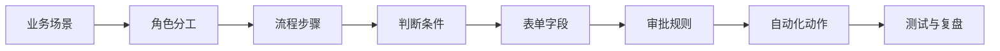

# AI工作流教学：以订单识别为例

> 这份笔记的目标，不是先教工具，而是先教“小白如何看懂一条订单工作流”。  
> 这里的“订单识别”，指的是把邮件、聊天记录、PDF、图片、Excel 里的零散订单信息，识别成可以执行的标准订单字段。

## 一、教程总定位

这是一套面向零基础学习者的入门教程，核心任务是让学习者从“看不懂流程”变成“能独立画出、写出、检查一条简单订单工作流”。

教程遵循的顺序是：

**业务场景 -> 角色分工 -> 流程步骤 -> 判断条件 -> 表单字段 -> 审批规则 -> 自动化动作 -> 测试复盘**

课程不是直接讲 n8n、Dify、表格公式或数据库，而是先让学习者知道：

1. 订单为什么会乱
2. 谁在流程里负责什么
3. 哪些步骤必须人工判断
4. 哪些步骤可以交给 AI 或自动化
5. 最后怎么把它做成一个能跑通的最小系统

## 二、教学目标

学完以后，学习者应该能做到：

- 看懂一条订单工作流的完整链路
- 区分客户、采购、审批人、供应商、财务各自的职责
- 画出一条从下单到归档的主流程
- 为流程设计基础字段和表单
- 识别哪些节点必须人工确认
- 说清楚哪些动作适合自动化，哪些动作不适合
- 用一个真实案例完成一次流程测试

## 三、贯穿案例

### 案例名称
公司采购 100 把办公椅

### 案例输入

- 客户提出采购需求
- 订单信息来自邮件、聊天记录、图片、PDF、Excel
- 需求可能反复变更，比如数量、材质、颜色、交期变化

### 主流程

客户下单 -> 订单确认 -> 库存检查 -> 采购申请 -> 供应商询价 -> 审批 -> 下单采购 -> 到货验收 -> 付款 -> 归档

### 这个案例为什么适合小白

- 场景直观，容易理解
- 流程完整，但不会复杂到吓人
- 每一步都能讲清楚“为什么要做”
- 很适合顺手讲订单识别、表单设计、审批和自动化

## 四、教学主线



这条主线很重要，因为小白最容易跳步：

- 还不知道流程是啥，就开始研究工具
- 还没分清角色，就开始谈自动化
- 还没定义字段，就开始做表单
- 还没测试，就以为流程做完了

## 五、8课完整大纲

| 课次 | 标题 | 学习目标 | 主要产出 | 建议时长 |
|---|---|---|---|---|
| 第1课 | 订单工作流到底在解决什么问题 | 看懂整条链路为什么存在 | 业务场景草图 | 10 分钟 |
| 第2课 | 谁在这条流程里做事 | 分清角色和责任 | 角色分工图 | 10 分钟 |
| 第3课 | 流程怎么从头走到尾 | 画出完整流程图 | 主流程图 | 12 分钟 |
| 第4课 | 哪些情况要继续，哪些情况要停下来 | 学会判断规则 | 规则清单 | 12 分钟 |
| 第5课 | 把流程变成可填写的表单 | 搭出字段和表单 | 字段表、表单模板 | 12 分钟 |
| 第6课 | 审批和异常怎么处理 | 理解人工节点和异常分流 | 审批规则表 | 12 分钟 |
| 第7课 | 怎么加入自动化和AI | 知道哪些动作可自动化 | 自动化动作清单、提示词模板 | 12 分钟 |
| 第8课 | 完整演练和复盘 | 独立跑通并优化流程 | 测试清单、最终项目包 | 15 分钟 |

## 六、每节课详细设计

### 第1课：订单工作流到底在解决什么问题

**学习目标**
- 理解订单不是一张表，而是一串状态变化
- 知道工作流存在的原因
- 明白订单识别为什么必须先看业务

**讲解重点**
- 订单从哪里来
- 订单为什么会乱
- 为什么流程比工具更重要

**操作步骤**
1. 读“100把办公椅”案例
2. 圈出所有参与角色
3. 找出流程起点和终点
4. 用一句话说清楚这条工作流在解决什么问题

**小练习**
- 用自己的话复述一次完整流程

**本课产出**
- 业务场景草图

### 第2课：谁在这条流程里做事

**学习目标**
- 分清客户、采购、审批人、供应商、财务的职责
- 明白谁接收信息，谁做决定，谁负责执行

**讲解重点**
- 角色边界
- 交接点
- 谁该看什么信息

**操作步骤**
1. 列出流程中的所有角色
2. 给每个角色写一句职责说明
3. 画一张简单泳道图
4. 标出每个角色在哪一步接棒

**小练习**
- 给每个角色写一句“我负责什么”

**本课产出**
- 角色分工图

### 第3课：流程怎么从头走到尾

**学习目标**
- 把口头流程变成可视化流程图
- 明白每一步都要有输入和输出

**讲解重点**
- 每一步的开始条件
- 每一步的结束条件
- 每一步完成后状态怎么变

**操作步骤**
1. 按主流程顺序写出每个节点
2. 给每个节点写输入和输出
3. 给每个节点标状态
4. 检查有没有遗漏的步骤

**小练习**
- 为每一步补上开始条件和结束条件

**本课产出**
- 完整流程图

### 第4课：哪些情况要继续，哪些情况要停下来

**学习目标**
- 学会判断规则
- 知道什么情况自动过，什么情况要停

**讲解重点**
- 库存够不够
- 金额大不大
- 报价是否一致
- 信息是否缺失

**操作步骤**
1. 列出自动通过规则
2. 列出人工确认规则
3. 列出必须退回规则
4. 把规则写成简单条件句

**小练习**
- 给库存不足、报价冲突、审批拒绝各写一个处理方案

**本课产出**
- 规则清单

### 第5课：把流程变成可填写的表单

**学习目标**
- 把流程里的信息整理成字段
- 知道什么信息必须填，什么信息可以后补

**讲解重点**
- 订单字段
- 采购字段
- 验收字段
- 付款字段

**操作步骤**
1. 做字段字典
2. 设计表单顺序
3. 定义必填项和选填项
4. 给字段写示例值

**小练习**
- 为办公椅案例补齐一份订单表

**本课产出**
- 表单和字段表

### 第6课：审批和异常怎么处理

**学习目标**
- 知道哪些节点必须人工
- 学会处理异常和版本变化

**讲解重点**
- 审批额度
- 异常升级
- 缺字段补问
- 版本变化记录

**操作步骤**
1. 做审批矩阵
2. 写异常处理卡
3. 规定谁能改什么
4. 定义哪些情况必须升级给人

**小练习**
- 判断 3 个场景是否需要人工审批

**本课产出**
- 审批规则表

### 第7课：怎么加入自动化和AI

**学习目标**
- 理解重复动作为什么适合交给工具
- 知道 AI 在流程里能帮什么忙

**讲解重点**
- 自动通知
- 自动建单
- 自动生成采购单
- 自动归档
- AI 提取和整理信息

**操作步骤**
1. 写自动化触发条件
2. 写自动化输出动作
3. 准备消息模板
4. 准备提示词模板

**小练习**
- 写一条“库存不足时自动提醒采购”的通知文案

**本课产出**
- 自动化动作清单
- 提示词模板

### 第8课：完整演练和复盘

**学习目标**
- 独立跑通一遍流程
- 学会测试和复盘

**讲解重点**
- 测试
- 纠错
- 复盘
- 优化

**操作步骤**
1. 用同一个案例跑一遍完整流程
2. 做库存充足场景测试
3. 做库存不足场景测试
4. 做审批被拒场景测试
5. 汇总问题并修正流程

**小练习**
- 找出流程里最容易出错的 3 个点并改进

**本课产出**
- 测试清单
- 最终项目包

## 七、适合小白的讲解方式

- 每节只讲一个新概念
- 先用大白话解释，再给流程图和表单
- 第一次出现的术语都要翻译成普通人能懂的话
- 全程只用一个案例，不换场景
- 讲法固定为：发生了什么、为什么这样做、你要怎么做、做完长什么样
- 先手工跑通，再谈自动化

## 八、常见错误和避坑提醒

- 一上来讲工具，学生会不知道为什么要做这些步骤
- 每节课换案例，学习者会断线
- 把状态、字段、动作混在一起，流程图会乱
- 所有节点都想自动化，结果漏掉最该人工确认的地方
- 只讲概念不留产出，学完还是不会做
- 不定义异常处理，真实业务一变就崩

## 九、最终交付成果

教程做完后，学习者至少要拿到这些东西：

1. 一张完整流程图
2. 一份角色分工表
3. 一套字段字典和表单模板
4. 一份审批规则表
5. 一套自动化动作说明和通知模板
6. 一套 AI 提示词模板
7. 一份测试清单和复盘记录
8. 一个可演示的迷你订单工作流项目

## 十、测试标准

- 学习者能在 5 分钟内说清这个流程为什么存在
- 学习者能独立画出流程主线，并标出关键角色和判断点
- 学习者能完成一轮案例测试，并指出至少 3 个异常处理点
- 学习者能把结果整理成可交付的图、表、规则和模板

## 十一、术语白话版

| 术语 | 白话解释 |
|---|---|
| 订单工作流 | 订单从出现到完成，按步骤往下走的流程 |
| 订单识别 | 把散乱信息变成标准订单字段 |
| 审批 | 让有权限的人确认后再继续 |
| 异常处理 | 出现问题时怎么改、怎么回退、怎么补救 |
| 自动化 | 让重复动作交给系统自己做 |
| AI 提取 | 让 AI 从文本、图片、PDF 里找出关键信息 |

## 十二、可复用模板

### 12.1 订单识别提示词模板

```text
你是一个订单信息整理助手。

请从下面内容中识别出订单关键信息，并整理成结构化字段：
- 客户名称
- 产品名称
- 数量
- 规格尺寸
- 材质
- 颜色
- 交期
- 供应商
- 备注

要求：
1. 如果某个字段缺失，请标记为“待确认”
2. 如果出现冲突信息，请优先保留最新确认内容
3. 输出为表格格式
4. 额外给出你不确定的字段

原始内容：
{{输入内容}}
```

### 12.2 订单字段表示例

| 字段 | 示例 | 是否必填 |
|---|---|---|
| 客户名称 | 张三公司 | 是 |
| 产品名称 | 办公椅 | 是 |
| 数量 | 100 | 是 |
| 规格尺寸 | 60cm x 55cm x 95cm | 是 |
| 材质 | 网布+钢架 | 否 |
| 颜色 | 黑色 | 否 |
| 交期 | 2026-07-20 | 是 |
| 备注 | 先发样品确认 | 否 |

### 12.3 测试清单

- 订单信息是否能被正确识别
- 缺失字段是否能被标出来
- 冲突信息是否能被保留最新版本
- 审批节点是否会被正确触发
- 自动通知是否能发到正确的人
- 最终归档文件是否完整

## 十三、建议的课程包装方式

- 如果做视频，建议拆成 8 集，每集 10 到 15 分钟
- 如果做直播课，建议一次讲完，但中间要留练习时间
- 如果做讲义，建议按“概念 + 图 + 表 + 练习”排版
- 如果做模板包，建议把流程图、表单、提示词、测试清单放在同一套资料里

## 十四、这套教程的核心提醒

小白教程最怕两件事：

1. 一开始就讲工具
2. 讲完没有产出

所以这套课的核心，不是“教学生认识一堆名词”，而是让他真的做出一个能跑通的小流程。

真正的顺序永远是：

**先理解业务 -> 再拆流程 -> 再定字段 -> 再设规则 -> 最后才上自动化**
