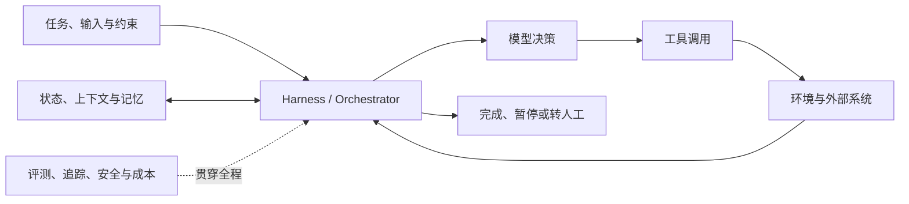

> 目标：不是只记住 Agent 的组件名，而是能够独立设计、实现、评测并部署一个**可控、可靠、可观测**的 Agent 系统。
>
> 建议周期：12～16 周（每周 8～12 小时）。如果 Python、API 调用和 LLM 基础较弱，先增加 2～4 周预备学习。

## 一、先修正原来的理解

原路径：

```text
Reasoning Model → Planner → Orchestrator → Specialist Agents →
Tool Layer (MCP) → Memory Layer → Reflection / Critic
```

这更像一张“高级多 Agent 系统组件清单”，不适合直接作为学习顺序。主要问题是：

1. **过早进入多 Agent**：多数任务先用单 Agent 或确定性工作流就能解决；多 Agent 会额外引入通信、状态同步、成本和错误传播问题。
2. **MCP 不等于 Tool Layer**：Function Calling/Tool Calling 是模型请求调用工具的机制；MCP 是 Host、Client、Server 之间发现和交换 Tools、Resources、Prompts 等上下文的标准协议。
3. **Memory 不等于 RAG**：RAG 主要解决外部知识检索；记忆还包括当前运行状态、短期会话、跨会话用户信息和经验。
4. **Reflection 不是默认必需**：先建立明确的成功标准与评测集，再决定是否加入 Reviewer/Critic；否则只会增加延迟和成本。
5. **缺少工程横切面**：Agent 的评测、可观测性、权限、安全、人工审批、异常恢复和成本控制必须贯穿全程。

更适合学习和实践的总体结构是：



推荐学习顺序：

```text
LLM 应用基础
→ 原生 Tool Calling
→ 最小 Agent Loop
→ 工作流与状态编排
→ RAG / Context / Memory
→ 评测、可观测性、HITL 与安全
→ MCP、Skills 与 Harness
→ 多 Agent
→ 部署与持续优化
```

## 二、学习原则

- **先不用框架实现，再用框架重构**：先理解消息、工具 schema、循环和状态，再学习 LangGraph 等框架。
- **Workflow first，Agent second**：步骤稳定时用代码和图固定流程；只有决策路径无法预先穷举时才让模型自主选择。
- **Single-agent first，multi-agent last**：先证明一个 Agent 做不好或上下文/权限必须隔离，再拆成多个 Agent。
- **Eval-driven development**：每增加工具、记忆或反思模块，都用固定测试集判断是否真的提升。
- **逐级增加权限**：默认只读；写文件、发消息、付款、删除等高风险动作必须校验参数、限制权限并加入人工确认。
- **围绕同一个项目迭代**：不要每学一个概念就换 Demo，应不断增强同一个项目，才能看清架构为何演进。

## 三、分阶段路线

### 阶段 0：编程与 LLM 应用基础（1～2 周）

#### 学习内容

- Python：函数、类、类型标注、异常处理、文件与 JSON、生成器。
- `httpx`/`requests`、REST API、认证、超时、重试和速率限制。
- `asyncio` 基础；并发调用与串行调用的区别。
- Pydantic / JSON Schema：结构化输入输出与参数校验。
- Git、环境变量、日志、`pytest`。
- LLM 基础：messages、system/user/tool role、token、上下文窗口、采样参数、结构化输出。
- Prompt 基础：任务、上下文、约束、示例、输出格式、失败处理。

#### 动手任务

1. 不使用 Agent 框架，调用任一模型 API 完成“结构化信息提取”。
2. 用 Pydantic 校验模型输出；针对字段缺失、格式错误和超时编写测试。
3. 记录每次请求的延迟、token 和估算成本。

#### 阶段产物与验收

- [ ] 一个带重试、超时、日志和结构化输出校验的 LLM API 小程序。
- [ ] 能解释“模型生成文本”和“应用执行动作”的责任边界。
- [ ] 至少 10 条输入样例，其中正常、边界和恶意输入都有覆盖。

### 阶段 1：Tool Calling 与最小 Agent Loop（1～2 周）

#### 学习内容

- Tool/Function Calling 的完整协议：定义 schema → 模型选择工具 → 本地校验与执行 → Tool Result 回填 → 模型继续决策。
- 工具设计：单一职责、清晰命名、窄参数、幂等性、超时、重试、错误返回。
- ReAct 的核心思想：在“决策—行动—观察”之间循环。
- 停止条件：得到最终答案、达到步数/时间/预算上限、错误熔断、请求人工帮助。
- 不要依赖或展示模型的隐藏思维链；保存可审计的决策摘要、工具参数和结果即可。

#### 使用现有笔记

- [理论 + 代码：从 ToolCall 到 Harness、Claw](<从ToolCall到Harness、Claw.md>)：重点学习 ToolCall 原理、手写协议、LangChain 实现和 Agent Loop。
- [大模型 Agent 知识从 0-1](<./大模型Agent知识从0-1笔记-万字详解版本！/大模型Agent知识从0-1笔记-万字详解版本！.md>)：阅读 Agent 架构、Tools、ReAct、无限循环和错误处理部分。

#### 动手任务

从零实现一个 100～200 行的 Agent：

- 工具：计算器、读取本地笔记、按文件名搜索。
- 循环：模型最多决策 8 步。
- 防护：参数校验、工具白名单、路径限制、单次超时和总预算。
- 追踪：记录每一步的模型响应、工具调用、结果、耗时和错误。

#### 阶段产物与验收

- [ ] 不依赖 LangChain/LangGraph 的最小 Agent Loop。
- [ ] 能区分结构化输出、Tool Calling、Agent 和 Workflow。
- [ ] 面对不存在的文件、无效参数、工具异常和循环任务时能安全停止。

### 阶段 2：Workflow、状态与编排（2 周）

#### 学习内容

- Workflow 与 Agent 的边界：固定路由、动态路由和混合式架构。
- 常见模式：Prompt Chaining、Routing、Parallelization、Orchestrator-Workers、Evaluator-Optimizer。
- 状态机/图：节点、边、条件路由、共享状态、子图。
- 持久化与恢复：checkpoint、重试、幂等、断点续跑。
- Human-in-the-loop（HITL）：暂停、审批、修改状态、恢复执行。
- Planner 与 Orchestrator 的区别：Planner 产生或调整计划；Orchestrator 管理执行、状态、路由、权限和生命周期。

#### 使用现有笔记

- [订单工作流资料总索引](<../AI工作流教学 以订单识别为例/00-课程总索引.md>)：重点复习角色、主流程、分支、停止条件、审批与异常。
- [订单自动识别工作流制作教程](<../AI工作流教学 以订单识别为例/订单自动识别工作流制作教程.md>)：把业务流程映射为可执行状态图。
- [理论 + 代码：从 ToolCall 到 Harness、Claw](<从ToolCall到Harness、Claw.md>)：学习 LangGraph 编排和条件边。

#### 动手任务

将阶段 1 的自由循环重构为一张显式状态图：

```text
接收任务 → 分类/路由 → 检索或调用工具 → 校验结果
                         ↓
                  低置信度/高风险 → 人工审批
                         ↓
                 输出结果或进入纠错
```

先手写轻量状态机，再用 LangGraph 重构并比较两种实现。

#### 阶段产物与验收

- [ ] 能画出状态、节点、条件边和终止条件。
- [ ] 程序中断后可从 checkpoint 恢复，而不是从头运行。
- [ ] 高风险动作在执行前暂停，只有明确批准后才能继续。
- [ ] 能说明哪些节点应由普通代码完成，哪些才需要 LLM。

### 阶段 3：Context Engineering、RAG 与 Memory（2～3 周）

#### 学习内容

先把三个概念分开：

| 概念 | 主要问题 | 典型实现 |
|---|---|---|
| Context | 本次模型调用应该看到什么 | 指令、工具定义、检索片段、状态裁剪 |
| RAG | 如何从外部知识库找到依据 | 切分、Embedding、混合检索、重排、引用 |
| Memory | 系统应该跨步骤/会话保留什么 | 工作状态、会话摘要、用户偏好、经验库 |

学习顺序：

1. 基础 RAG：文档加载、切分、Embedding、Vector Store、Top-k 检索、带引用生成。
2. 检索评测：Recall@k、MRR/nDCG、答案正确性、忠实度、引用准确性。
3. 检索优化：元数据过滤、BM25 + 向量混合检索、Query Rewrite、Rerank。
4. 短期记忆：线程状态、消息裁剪、摘要、checkpoint。
5. 长期记忆：语义记忆（事实）、情景记忆（经历）、程序性记忆（规则/技能）；写入、检索、更新、遗忘与冲突处理。
6. Context 管理：只注入当前步骤需要的信息，避免“把所有历史都塞进 prompt”。

#### 使用现有笔记

- [大模型 RAG 技术从小白到深入理解](<./RAG技术从小白到深入理解/大模型RAG技术从小白到深入理解.md>)：先完成基础架构、检索指标、混合检索和重排，再按需求学习 Multi Query、RAG-Fusion、CRAG、Self-RAG 等高级策略。
- [大模型 Agent 知识从 0-1](<./大模型Agent知识从0-1笔记-万字详解版本！/大模型Agent知识从0-1笔记-万字详解版本！.md>)：复习短期/长期记忆和上下文溢出。

#### 动手任务

为自己的 `Study_Notes` 制作“笔记研究助手”：

- 回答必须给出文件名和原文片段位置。
- 检索不到时明确说不知道，不允许用常识伪装为笔记内容。
- 区分“从笔记回答”和“联网补充”；联网内容保存来源与访问日期。
- 保存用户偏好，但提供查看、修改和删除记忆的入口。

#### 阶段产物与验收

- [ ] 30～50 条问题组成的检索/问答评测集。
- [ ] 与“无 RAG”和“仅向量 Top-k”基线进行对比。
- [ ] 每个答案都能追溯到证据，冲突信息不会被悄悄合并。
- [ ] 能解释 conversation history、checkpoint、long-term memory 和知识库的区别。

### 阶段 4：可靠性、Reflection、评测与安全（2 周）

#### 学习内容

- 先定义成功标准，再决定是否增加 Reflection/Critic。
- 评测分层：
  - 单工具：选对工具、参数正确、错误处理正确。
  - 单轨迹：步骤数、无效调用率、是否越权、能否停止。
  - 端到端：任务成功率、答案质量、引用质量。
  - 运行指标：延迟、token、费用、失败率、人工接管率。
- 评测方法：确定性断言、规则评分、人工评分、LLM-as-judge；关键任务不能只依赖 LLM 裁判。
- Reflection/Evaluator-Optimizer：仅用于有清晰评价标准且迭代有收益的任务，并设置最大轮数。
- 安全：Prompt Injection、工具滥用、过度授权、敏感信息泄露、恶意工具输出、记忆污染、供应链风险。
- 防护：最小权限、沙箱、输入/输出校验、来源标记、审批、审计日志、速率/预算限制、失败关闭（fail closed）。

#### 使用现有笔记

- [理论 + 代码：从 ToolCall 到 Harness、Claw](<从ToolCall到Harness、Claw.md>)：复习 Reflection、Reviewer 和循环保护。
- [大模型 Agent 知识从 0-1](<./大模型Agent知识从0-1笔记-万字详解版本！/大模型Agent知识从0-1笔记-万字详解版本！.md>)：复习工具误选、卡死、鲁棒性、成本控制。

#### 动手任务

1. 为笔记助手建立 golden dataset，并在每次修改 Prompt、工具或模型后自动回归。
2. 注入至少 10 个对抗样例：要求泄露密钥、越权读写、执行文档中的恶意指令、污染记忆等。
3. 对比“无 Reflection”和“最多一次 Reflection”的质量、延迟和成本，依据数据决定是否保留。

#### 阶段产物与验收

- [ ] 一条命令运行离线评测并生成结果表。
- [ ] 可以查看完整 trace，但日志不泄露密钥或敏感内容。
- [ ] 对高风险失败默认停止并转人工，而不是猜测后继续。
- [ ] 架构选择有基线数据支持，而不是凭感觉添加模块。

### 阶段 5：MCP、Skills 与 Agent Harness（2 周）

#### 学习内容

- MCP 架构：Host、Client、Server；初始化、能力协商和生命周期。
- MCP primitives：Tools、Resources、Prompts；理解它们各自的控制方和使用场景。
- Transport：stdio 与 Streamable HTTP；认证、授权和远程服务风险。
- Tool Calling 与 MCP 的关系：前者解决“模型如何表达工具调用”，后者解决“应用如何标准化发现、连接和交换能力/上下文”。
- Skill：可复用的领域说明、流程、脚本、模板与资源；不是新模型。
- Harness：围绕模型的运行环境，包括上下文装配、工具注册、状态循环、权限、子任务、压缩、日志、恢复和验证。

#### 使用现有笔记

- [理论 + 代码：从 ToolCall 到 Harness、Claw](<从ToolCall到Harness、Claw.md>)。
- [Superpowers Skill 笔记](<./Skill/Superpowers is an agentic skills framework/Superpowers  skill.md>)。
- [Harness 实践：知识点讲解“视频”网页](<./Skill/Harness 实践：让 Agent 全自动制作知识讲解视频/让Agent 全自动制作知识点讲解“视频”网页.md>)。

#### 动手任务

1. 将“读取/搜索学习笔记”封装成一个只读 MCP Server。
2. 分别暴露一个 Resource 和一个 Tool，并说明为什么这样划分。
3. 使用 MCP Inspector 调试 schema、错误响应和生命周期。
4. 为笔记研究助手编写一个 Skill：规定研究流程、引用格式、验收清单与可复用脚本。

#### 阶段产物与验收

- [ ] 一个可由两个不同 MCP Host 使用的本地 Server。
- [ ] Server 不接受工作区外路径，写操作默认未开放。
- [ ] 能独立解释 Model、Agent、Workflow、MCP、Skill、Harness 的边界。

### 阶段 6：多 Agent 与高级编排（1～2 周，可选）

#### 进入本阶段前必须满足

只有出现以下至少一种情况，才考虑多 Agent：

- 不同角色需要相互隔离的上下文或不同工具权限。
- 单个上下文过大，拆分后可以明显降低干扰。
- 子任务能安全并行，并且存在可验证的合并规则。
- 经过评测，单 Agent 的瓶颈确实无法靠更好的工具、Prompt、RAG 或工作流解决。

#### 学习内容

- 模式：Manager-Workers、Router-Specialists、并行专家、Debate/Critic。
- 任务委派：输入契约、输出 schema、完成定义、超时、重试、取消。
- 状态所有权：谁能读、谁能写、共享什么、如何解决冲突。
- 结果合并：去重、证据校验、冲突检测，不让“多数投票”替代事实验证。
- 失败隔离：子 Agent 失败不能无限重启或拖垮整个系统。

#### 动手任务

把笔记助手拆成：Researcher（只读检索）→ Writer（生成答案）→ Verifier（核验引用）。同时保留单 Agent 基线，比较：

- 任务成功率与引用准确率；
- 平均延迟、token 和成本；
- 错误恢复与调试难度。

如果多 Agent 没有显著收益，就保留更简单的架构。这也是正确结论。

#### 阶段产物与验收

- [ ] 每个 Agent 都有清晰职责、权限和输入输出契约。
- [ ] 与单 Agent 基线有量化对比。
- [ ] 子任务存在超时、取消、预算上限和失败降级。

### 阶段 7：生产化与持续优化（持续）

#### 学习内容

- 服务化：API、流式输出、任务队列、并发、限流。
- Durable Execution：持久化状态、断点恢复、幂等与补偿事务。
- 可观测性：trace、结构化日志、指标、告警、用户反馈闭环。
- 版本管理：Prompt、工具 schema、模型、索引和评测集都要可追踪。
- 成本与性能：缓存、模型路由、并行、上下文压缩、批处理。
- 数据治理：隐私、保留周期、删除机制、审计和权限分层。
- 上线策略：离线评测 → shadow/canary → 小流量 → 持续监控。

#### 最终验收

- [ ] 新版本未通过回归评测不能上线。
- [ ] 能定位一次失败发生在检索、规划、工具、模型、状态还是权限层。
- [ ] 能从中断点安全恢复，不重复执行有副作用的动作。
- [ ] 有明确的服务等级目标、成本上限、降级策略和应急关闭开关。

## 四、推荐的贯穿式项目

### 项目 A：个人学习笔记研究助手（主项目）

按阶段逐步增加能力：

```text
结构化问答
→ 本地工具调用
→ Agent Loop
→ 状态图与人工审批
→ RAG 与引用
→ 记忆与上下文压缩
→ 自动评测与安全测试
→ MCP Server + Skill + Harness
→ 可选的多 Agent 对比
→ 部署与监控
```

核心成功标准：答案有证据、检索不到会拒答、不越权修改文件、失败可恢复、版本可回归。

### 项目 B：订单自动识别工作流（业务项目）

利用现有的[订单工作流资料](<../AI工作流教学 以订单识别为例/00-课程总索引.md>)和 PaddleOCR 笔记，重点练习：

- OCR/多模态结果的结构化校验；
- 规则节点与 LLM 节点的合理边界；
- 低置信度、字段冲突、重复订单和异常格式处理；
- 高风险动作人工审批；
- 端到端准确率、人工接管率和单订单成本。

## 五、每周学习模板

以每周 10 小时为例：

| 时间 | 占比 | 内容 |
|---|---:|---|
| 2 小时 | 20% | 阅读官方资料和现有笔记，只整理关键概念与疑问 |
| 5 小时 | 50% | 编码同一个贯穿项目，先最小实现再重构 |
| 2 小时 | 20% | 补测试、评测集、trace、安全用例和性能数据 |
| 1 小时 | 10% | 复盘：本周假设、失败案例、指标变化和下周实验 |

每周至少保留四类记录：

1. **概念卡片**：一句话定义、适用场景、反例。
2. **架构决策记录（ADR）**：为什么选/不选某个框架或模式。
3. **失败样例库**：输入、轨迹、根因、修复、是否加入回归集。
4. **实验表**：变更项、成功率、延迟、token、成本和结论。

## 六、知识点依赖与优先级

### P0：必须掌握

- Python/API/JSON Schema/异步与测试。
- Prompt、结构化输出、Tool Calling、Agent Loop。
- 状态、路由、停止条件、HITL、错误恢复。
- 基础 RAG、上下文管理、短期与长期记忆的区别。
- 评测集、trace、最小权限、Prompt Injection 防护和成本控制。

### P1：项目需要时掌握

- LangGraph、LangSmith 或同类编排与可观测工具。
- 混合检索、Rerank、Query Rewrite、高级 RAG。
- MCP Server、Skills、Harness。
- 持久化队列、服务化和部署。

### P2：最后学习或按需研究

- 多 Agent Debate、群体协作和复杂自治组织。
- 复杂 Reflection、自我改写 Prompt、自动生成工具。
- GraphRAG、RAPTOR、ColBERT 等重型检索方案。
- 模型微调、强化学习和自训练 Agent。

判断规则：**如果 P0 尚未形成可运行、可评测的项目，不要用 P2 延迟交付。**

## 七、推荐官方资料

以下资料用于校准学习方向，框架 API 可能变化，实践时以最新官方文档为准：

1. [Anthropic：Building Effective AI Agents](https://www.anthropic.com/engineering/building-effective-agents)——区分 Workflow 与 Agent，并介绍常见的可组合模式；核心建议是从简单方案开始。
2. [OpenAI：A Practical Guide to Building Agents](https://openai.com/business/guides-and-resources/a-practical-guide-to-building-ai-agents/)——模型、工具、指令、编排、Guardrails 与评测的工程框架。
3. [LangGraph Overview](https://langchain-ai.github.io/langgraph/)——状态图、持久化、Human-in-the-loop、Memory、调试和部署。
4. [LangGraph Memory](https://langchain-ai.github.io/langgraph/agents/memory/)——短期线程状态、长期记忆、消息裁剪、摘要和 checkpoint。
5. [Model Context Protocol：Architecture Overview](https://modelcontextprotocol.io/docs/learn/architecture)——Host/Client/Server、Tools/Resources/Prompts、生命周期和 Transport。
6. [OpenAI Evals API](https://platform.openai.com/docs/api-reference/evals)——评测结构、测试数据、评分器和评测运行。
7. [OWASP Top 10 for Agentic Applications 2026](https://genai.owasp.org/resource/owasp-top-10-for-agentic-applications-for-2026/)——Agent Goal Hijacking、工具滥用、权限、供应链、记忆污染等风险。
8. [OWASP：Securing Agentic Applications Guide](https://genai.owasp.org/resource/securing-agentic-applications-guide-1-0/)——面向 Agent 应用开发和部署的具体安全建议。

## 八、最终能力自检

学完后，应能不依赖框架术语回答并实现下面的问题：

- [ ] 什么任务只需要一次 LLM 调用，什么任务适合 Workflow，什么任务才需要 Agent？
- [ ] Agent Loop 的状态、动作、观察和停止条件分别是什么？
- [ ] 如何设计一个不易误用、可校验、可重试且权限最小的工具？
- [ ] RAG、短期记忆、长期记忆和 checkpoint 分别解决什么问题？
- [ ] 如何证明增加 Planner、Reflection 或多个 Agent 后真的变好了？
- [ ] 如何让有副作用的动作可审批、可审计、可恢复且不被重复执行？
- [ ] Tool Calling、MCP、Skill 和 Harness 的边界是什么？
- [ ] 如何建立离线评测、线上监控和失败样例回流闭环？
- [ ] 如何防止 Prompt Injection、工具滥用、越权访问和记忆污染？
- [ ] 当模型、工具或框架升级时，如何用回归评测安全迁移？

---

> 一句话总结：**先做出最小可运行闭环，再增加状态与知识；先评测和加护栏，再提高自治程度；先单 Agent，再多 Agent；所有复杂度都必须用指标证明其价值。**
