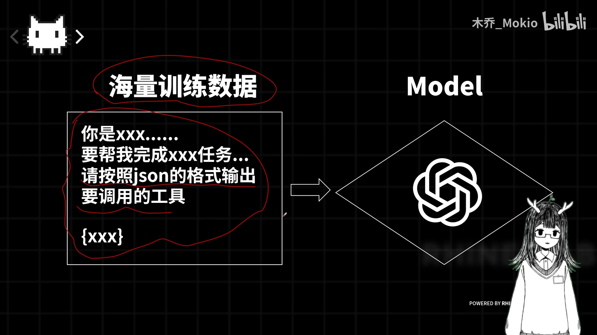
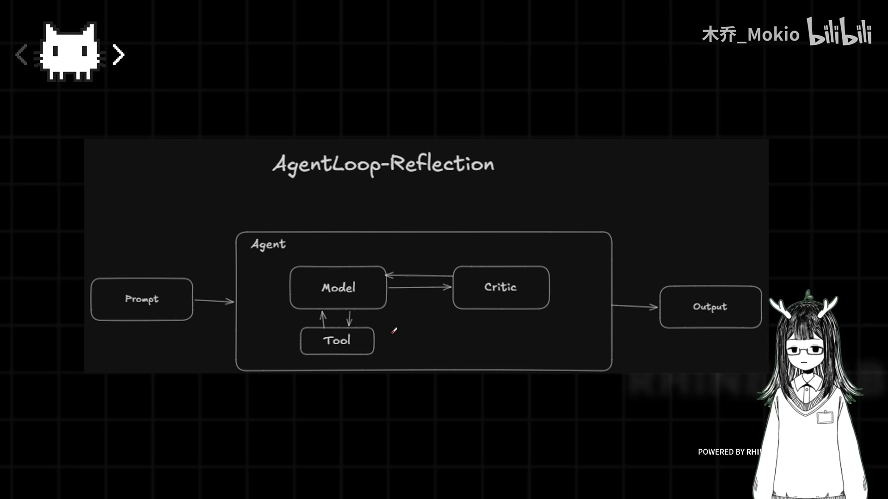
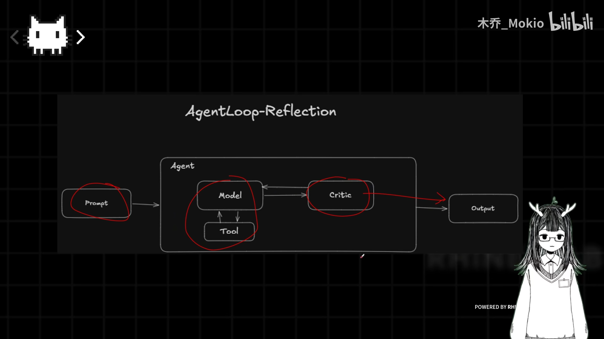
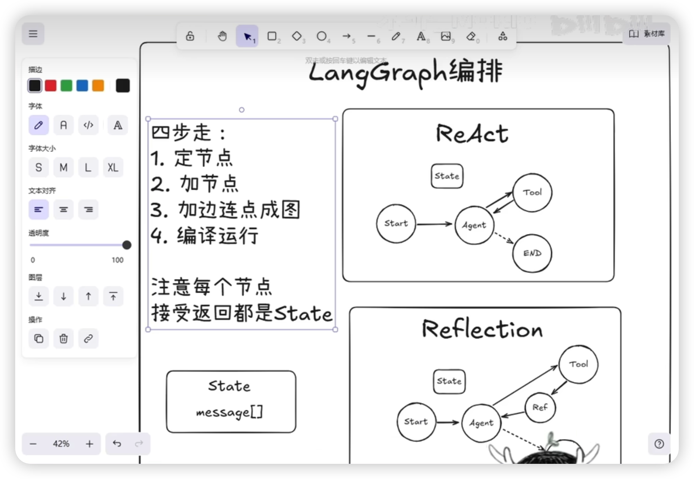
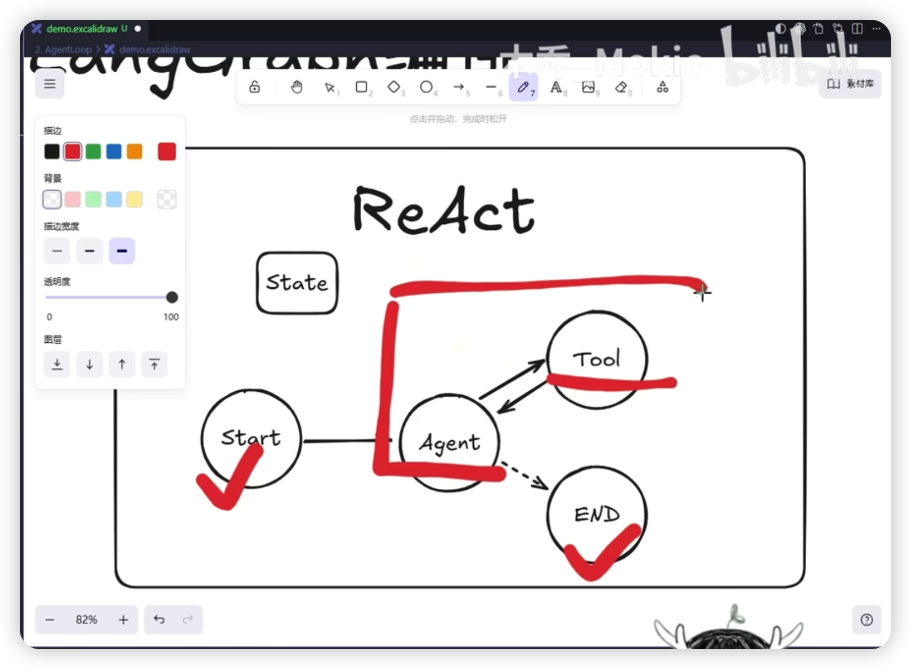
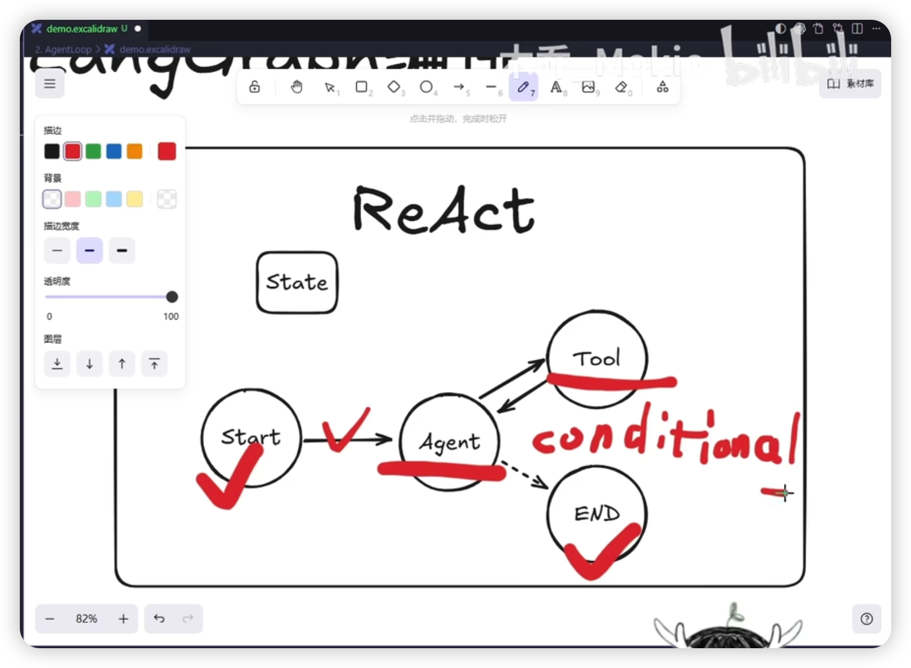
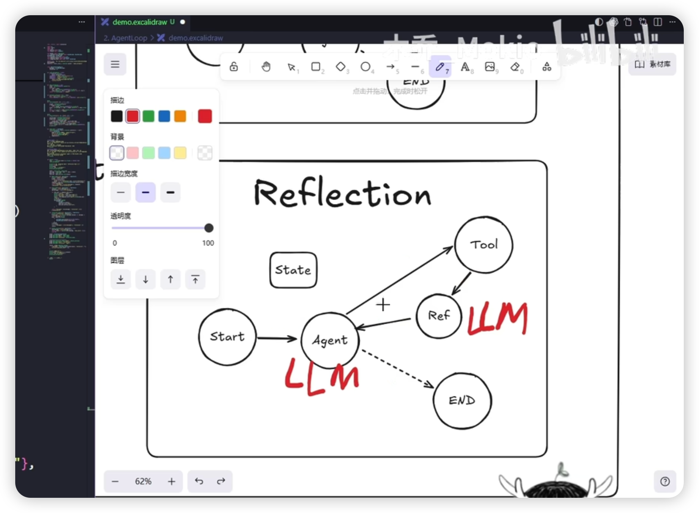

> 系列学习笔记：从 ToolCall 的底层原理与代码实现，延伸到 Agent Loop 中的 Reflection 范式。

## 前置学习资源

| [快速入门 - LangChain 文档 --- Quickstart - Docs by LangChain](https://docs.langchain.com/oss/python/langchain/quickstart)              |
| --------------------------------------------------------------------------------------------------------------------------------- |
| 【从pip到uv：一口气梳理现代Python项目管理全流程！】https://www.bilibili.com/video/BV13WGHz8EEz?vd_source=cb8aa1c7c46e4af8f825bfcbba1dcc71             |
| 【【闪客】一口气拆穿Skill/MCP/RAG/Agent/OpenClaw底层逻辑】https://www.bilibili.com/video/BV1ojfDBSEPv?vd_source=cb8aa1c7c46e4af8f825bfcbba1dcc71 |
| [从ToolCall开始组装自己的Claw](https://mirage-thought-d06.notion.site/ToolCall-Claw-334747825dae800bbf46c8eb0008e5b2)                     |

---

## 第一部分：ToolCall 理论

### 简介
- GitHub 仓库：[Wood-Q/MokioAgent](https://github.com/Wood-Q/MokioAgent)（分为 master 项目分支和 theory 理论分支）
- Notion 笔记：[ToolCall / Claw](https://www.notion.so/ToolCall-Claw-334747825dae800bbf46c8eb0008e5b2?pvs=74)
- PPT：见 GitHub 仓库的 `theory` 分支

---

### 核心概念

#### 一、Agent 的本质
> **核心观点**：Agent 的本质是**对模型输入和输出的文本进行操作**，所有后续处理都是基于这一原理。

**第一性原理视角**：
```
输入字符串 → LLM → 输出字符串
```
无论后续如何包装，这一本质不会改变 —— 本质上是文本进、文本出的 API。

---

#### 二、Function Calling 的背景与动机

##### 2.1 问题起源
2023 年 ChatGPT 发布时，模型存在明显局限：

| 阶段         | 表现               | 问题            |
| ---------- | ---------------- | ------------- |
| ChatGPT 时期 | 上知天文、下知地理        | 只能对话交流，无法实际操作 |
| 询问实时问题     | "Sorry，无法获取实时数据" | 只是一个 "大号字典"   |
| 时效性问题      | 无法回答有实效性的问题      | 知识有截止日期       |

##### 2.2 核心痛点
> 模型只能交流，**不能与现实世界交互**。

##### 2.3 解决方案

OpenAI 推出 Function Calling，让模型能够**调用外部工具**。

---

#### 三、Function Calling 的实现原理

##### 3.1 手动实现思路
```
用户 Prompt → 模型思考 → 按格式输出 → 本地代码解析 → 执行工具
```

**格式要求示例**：
- 约定使用 `<tool>` 标签包裹工具名
- 模型输出：`Here is the search <tool>search</tool> to perform the task.`
- 本地解析：提取 `search`，找到对应函数，执行

##### 3.2 本质定义
> **Function Calling 的本质**：让模型去**结构化输出**，然后由本地代码**翻译并执行**

**结构化输出形式**：

| 形式 | 示例 |
| --- | --- |
| XML 标签 | `<tool>search</tool>` |
| JSON 格式 | `{"tool": "search"}` |

##### 3.3 解决幻觉问题

**问题**：模型可能有幻觉，不按约定格式输出

```
期望输出：<tool>search</tool>
异常输出：search 或者 tool search
```

**解决方案**：OpenAI 通过大量训练数据，从底层强制模型按照 JSON 格式输出，将模型训练成 "严谨的理科生"。


> **关键**：开启 Function Calling 模式后，模型底层的输出概率被强制干预，保证输出纯净的 JSON 格式。

**原因**：工程实践中，解析错误可能导致灾难性后果。

---

#### 四、ToolCall 与 Function Calling 的关系

**补充说明**：
> Function Calling 是 OpenAI 在 2023 年 6 月推出的 API 功能，用于让模型调用外部工具。"ToolCall" 是后续社区和厂商对这一能力更通用的称呼，本质上是同一概念。

---
#### 五、面试题

##### Q1：Agent 的本质是什么？为什么说所有后续处理都是针对输入输出文本？

**答案**：Agent 的本质是对模型输入和输出的文本进行操作。从第一性原理看，LLM 本质上是一个 "输入字符串 → 输出字符串" 的 API。无论后续如何包装，这一本质不会改变 —— 所有工具调用、函数执行都是基于对输入文本的指令构造和对输出文本的解析。

---

##### Q2：为什么 ChatGPT 时代的模型需要 Function Calling？

**答案**：因为当时的模型只能对话交流，无法与现实世界交互。当用户询问实时问题（如 "北京天气怎么样"）时，模型只能道歉说无法获取实时数据。这种局限性使得模型 "充其量只是一个大号字典"，可以查阅知识，但不能解决现实问题或有时效性的问题。Function Calling 的出现解决了这一痛点。

---

##### Q3：Function Calling 的本质是什么？请简述其工作流程。

**答案**：Function Calling 的本质是让模型进行**结构化输出**，然后由本地代码**翻译并执行**。工作流程为：用户在 Prompt 中指定格式要求 → 模型思考后按约定格式输出（JSON 或标签包裹）→ 本地代码解析提取工具名和参数 → 找到对应函数执行 → 获取结果返回模型继续处理。

---

##### Q4：模型输出幻觉问题时，Function Calling 如何保证可靠性？

**答案**：OpenAI 通过**大量专项训练**解决这一问题。具体做法是喂给模型海量的函数调用训练数据，反复训练模型按照固定的 JSON 格式输出，将模型 "训练成严谨的理科生"。开启 Function Calling 模式后，模型底层的输出概率会被强制干预，保证输出纯净的结构化格式，避免解析错误带来的灾难性后果。

---

##### Q5：Function Calling 和 ToolCall 是什么关系？

**答案**：Function Calling 是 OpenAI 在 2023 年 6 月推出的 API 功能名称，ToolCall 是后续社区和厂商对这一能力的更通用称呼。本质上两者是同一概念，都指让大语言模型调用外部工具的能力。不同厂商可能有不同的命名：OpenAI 叫 Function Calling，Anthropic 叫 Tool Use，社区常用 ToolCall 或 Tool Calling。

---

##### Q6：为什么说解析错误对工程项目可能是灾难性的？

**答案**：因为 Function Calling 通常用于自动化执行关键任务（如发送邮件、转账、操作数据库等）。如果模型输出格式不统一，本地代码无法正确解析工具名和参数，可能导致：调用错误工具、执行错误操作、数据损坏等严重问题。与普通对话不同，Function Calling 的输出会被直接执行，错误的输出会产生实际的负面后果，所以对可靠性要求极高。

---

## 第二部分：ToolCall 代码实现
### 简介

GitHub 仓库：[Wood-Q/MokioAgent](https://github.com/Wood-Q/MokioAgent)（分为 master 项目分支和 theory 理论分支）
Notion 笔记：[ToolCall / Claw](https://www.notion.so/ToolCall-Claw-334747825dae800bbf46c8eb0008e5b2?pvs=74)
PPT：见 GitHub 仓库的 `theory` 分支

---

### 核心内容总结

#### 一、文本解析实现 ToolCall（基础原理）
**核心思路**：模拟模型如何从文本中解析出工具名和参数。
![[Pasted image 20260714032339.png]]
```python
# 定义工具函数
def get_weather(city):
    return f"{city}天气是25度"

# 解析函数：用split分割文本
tool_name = "get weather"
city = "北京"
```

**执行流程**：

1. 模型输出文本：`get weather北京`
2. 解析出工具名 `get weather` 和参数 `北京`
3. 调用实际函数执行

---

#### 二、自定义协议实现 ToolCall/Fountion Calling
**prompt协议设计**：

- 用 `<tool_call>` 标签包裹工具名
- 用 `<tool_args>` 标签包裹参数
![[Pasted image 20260714032805.png]]
**代码实现**：

```python
import re

# 正则表达式解析
def parse_tool_call(text):
    tool_match = re.search(r'<tool_call>(.*?)</tool_call>', text)
    args_match = re.search(r'<tool_args>(.*?)</tool_args>', text)
    return tool_match.group(1), args_match.group(1)

# 加载模型（使用百炼deepseek-v4-flash）
chat = ChatOpenAI(
    model="deepseek-v4-flash",
    base_url="...",
    api_key="..."
)

# 系统prompt规定输出格式
system_prompt = "你是一个助手，必须按照<tool_call>工具名</tool_call><tool_args>参数</tool_args>格式回答"

# 执行流程，invoke把上面的信息传给模型
response = chat.invoke([
	SystemMessage(content=SYSTEM_PROMPT),
	HumanMessage(content=user_prompt),
	])
#把原始的输出进行一个工具调用解析
tool_name, args = parse_tool_call(response.content)
if tool_name == "get_weather":
    result = get_weather(args)
```

**问题**：自定义协议会导致上下文窗口拉长，模型可能出现幻觉（少打一个半角括号就崩溃）。

---

#### 三、LangChain 实现 ToolCall
**使用装饰器**：
[[装饰器知识点{done}]]
```python
from langchain_core.tools import tool
#直接使用装饰器包裹工具
@tool
def get_weather(city: str) -> str:
    """Get the weather for a city (工具描述，会自动传递给模型)"""
    return f"{city}天气是25度"
```
**自己增加工具：**
工具中的注释在Langchain中会自动解析转换为对工具的描述
```Python
@tool
def get_time(city: str) -> str:
    """Get the current time of city"""
    return "当前时间：2026年"
```

**绑定工具到模型**：

```python
llm_with_tools = llm.bind_tools([get_weather, get_time])#把get_weather这个工具与模型绑定
response = llm_with_tools.invoke(prompt)
# response.tool_calls 会自动解析出工具调用
```

**LangChain 内部原理**：

- 使用 `tool_calls` 属性存储工具调用信息
- 包含工具名、参数、id 等信息
- 本质是从 API 原始返回值中提取 `function_calling` 和 `tool_calls` 字段

---
### 技术演进路线

| 阶段 | 方式 | 特点 |
| --- | --- | --- |
| 1 | 纯文本字符串解析 | 简单但不可靠 |
| 2 | 自定义协议（XML 标签） | 明确但开销大、易出错 |
| 3 | LangChain 装饰器 | 自动化封装、简洁易用 |
| 4 | 模型原生支持 | API 直接返回 tool_calls |

---

### 面试题
#### 1. 请简述 ToolCall 的基本工作原理

**答案**：
ToolCall（工具调用）的本质是让大模型能够识别并执行外部函数。其基本原理是：

1. **定义工具**：提前准备好可调用的函数及其描述
2. **协议解析**：从模型输出中解析出工具名和参数（可通过正则、split 等方式）
3. **函数执行**：根据解析结果调用对应的实际函数
4. **结果返回**：将执行结果反馈给模型继续处理

#### 2. 为什么自定义协议方式存在缺陷？

**答案**：

1. **上下文膨胀**：需要额外文本描述协议格式，占用大量 token
2. **鲁棒性差**：模型可能遗漏标签（如少打一个括号），导致解析失败
3. **幻觉问题**：模型可能生成格式错误的输出
4. **维护困难**：需要手动维护解析逻辑和协议一致性

#### 3. LangChain 中 `@tool` 装饰器的作用是什么？

**答案**：
`@tool` 装饰器的作用是将普通函数转换为 LangChain 可识别的工具，具备以下功能：

1. **自动生成工具描述**：函数 docstring 会被自动解析为工具描述，传递给模型
2. **参数类型推断**：通过类型注解让模型了解参数格式
3. **标准化接口**：将函数封装为统一的 Tool 对象，支持 `bind_tools()` 绑定到模型

#### 4. 工具调用的完整执行流程是什么？

**答案**：

1. **构建 Prompt**：包含系统指令、用户请求、工具定义
2. **模型推理**：模型分析后决定是否调用工具
3. **解析响应**：从模型输出中提取 tool_call 信息（通过 LangChain 的 tool_calls 属性或自定义解析）
4. **函数调用**：根据工具名和参数执行对应函数
5. **结果反馈**：将执行结果作为上下文继续调用模型（或直接返回）

#### 5. 模型原生的 function calling 与文本解析方式有什么区别？

**答案**：

- **文本解析方式**：需要通过 Prompt 约束模型输出特定格式，然后用正则或字符串分割解析
- **原生 function calling**：模型在预训练阶段已学会识别工具调用模式，API 返回中直接包含 `tool_calls` 字段，解析更可靠、更高效
- 本质上原生方式是模型能力内化的体现，而文本解析是外部模拟

---

## 第三部分：ReAct/Reflection 理论与代码

> 实现了FountionCalling模型能够完成单一的“动作“，但是无法完成一个”任务“。于是提出了：ReAct最经典的Loop范式，

#### ReAct
即是reasoning action思考和行动 
![[Pasted image 20260714042117.png]]
模型在一轮工具调用后把输出再传回模型，进行思考是否还需要调用工具，如不需要则输出answer

**假设现在有一个任务：**
我们需要agent检查inbox，并且把a.txt文件移动到archive文件夹，然后输出文件整理后的目录变化。

我们需要使用到Tool:
- list_files列出文件；
- move_file移动文件

![[Pasted image 20260715154742.png]]
langchain ReAct代码思路：
```Python
# 导入LangChain核心消息类型（必需依赖）
from langchain_core.messages import SystemMessage, HumanMessage, ToolMessage
def main() -> None:
    # 1. 初始化对话上下文：系统提示词 + 用户任务
    messages = [SystemMessage(content=SYSTEM_PROMPT), HumanMessage(content=task)]

    # 2. 开启Agent循环，最多执行7轮工具调用（range左闭右开，1~7共7次）
    for turn in range(1, 8):
        print(f"\n--- 第 {turn} 轮：模型思考 ---")

        # 3. 调用大模型，传入完整对话历史获取响应
        response = llm.invoke(messages)
        # 将模型的AI回复追加到对话历史
        messages.append(response)

        # 4. 终止条件：模型没有发起工具调用，直接输出最终答案
        if not response.tool_calls:
            print("\n最终回答:")
            print(response.content)
            break

        # 5. 解析模型的工具调用指令（示例仅处理第1个工具调用）
        tool_call = response.tool_calls[0]
        print("\n模型决定调用工具:")
        print(f"tool_name = {tool_call['name']}")
        print(f"tool_args = {tool_call['args']}")

        # 6. 执行对应工具，获取工具执行结果
        result = tool_map[tool_call["name"]].invoke(tool_call["args"])
        print("\n工具返回:")
        print(result)

        # 7. 将工具结果以ToolMessage格式回填到对话历史，进入下一轮思考
        messages.append(
            ToolMessage(content=str(result), tool_call_id=tool_call["id"])
        )

```
这是比较简单粗暴的方式实现react，langchain已经帮我们准备好了create_agent()方法，里面有封装好的react loop
**Langchain实现方法：**
![[Pasted image 20260715194611.png]]
这是langchain里`create_agent()`函数，其实就是他给你封装好了一个 Agent 的构造器。Agent 需要的是 model、tools 和 system prompt 中间件，还有回复的格式化状态、上下文管理等内容。
在Langchain里实现：
```Python
from langchain.agents import create_agent
agnet = create_agent(
	model=load_llm(),
	tools=[list_files,move_file],
	system_prompt=SYSTEM_PROMPT,
	)
result=agent.invoke({"message":[{"role":"user","content":task}]})
```

ReAct 模型虽然能完成任务，但存在明显缺陷：
> **像一个急于表现的实习生**：代码写完看都不看就直接交给你，结果执行时处处报错。

**存在问题：**
ReAct 模型只能**完成任务**，但**不看完成的结果**。这导致模型输出的代码或解决方案质量不可控。


**解决方案:**

在 ReAct 的思考（Think）→行动（Action）→反馈（Observation）循环中，引入第四个节点：**批判（Critic）**


工作流程：
1. 模型完成任务后，**优先将结果输送给 Critic**
2. Critic 拿原始任务和已完成信息进行对比
3. Critic 判断：**打回给模型重新修改**，还是**直接输出**

---

**Reflection与 ReAct 的对比**
![[Pasted image 20260716002209.png]]

| 组件 | ReAct | Reflection |
| --- | --- | --- |
| 节点数 | 3 | 4 |
| 新增节点 | – | Critic/Reviewer |
| 反馈机制 | 无 | 模型自检 |

**信息流设计**
```
Task → Think → Action → Observation → Critic → [打回 Think | 输出 End]
```
Critic 本质上也是一个大模型节点，接受原始任务和工具执行结果，给出下一步建议。

---

### LangGraph 实现react

**LangGraph 编排四步走**

1. **定义节点**：明确每个节点的职责
2. **加入节点**：将节点添加到 graph
3. **编排边**：编辑节点间的信息流向
4. **类型对齐**：确保发送和接收的数据类型一致
**State 设计**：统一使用 `state` 结构，其中包含 `messages` 数组作为消息队列。


**使用LangGraph进行ReAct节点定义**


**Agent Node（模型思考节点）**：
- 接收 `AgentState`
- 返回 `AgentState`
- 执行逻辑：大模型根据 system prompt 返回消息，放到 state 里

**Tools Node（工具执行节点）**：
- 接收 `AgentState`
- 解析并执行工具调用
- 将工具执行结果添加到 state

**条件边逻辑**


```python
def should_continue(state: AgentState) -> str:
    """判断是否需要继续工具调用"""
    if last_message_has_tool_calls(state):
        return "tools"
    else:
        return "END"
```

只要模型输出里没有 `tool_calls` 属性，就让信息流向 End 节点。

**完整 ReAct 图的连边**

```
start → agent → [should_continue] → tools → agent
                ↓ (无tool_calls)
                 END
```

**Langgraph代码完整实现：**

```python
from __future__ import annotations

import os
import shutil
import sys
from pathlib import Path
from typing import TypedDict

from dotenv import load_dotenv
from langchain_core.messages import BaseMessage, HumanMessage, SystemMessage, ToolMessage
from langchain_core.tools import tool
from langchain_openai import ChatOpenAI
from langgraph.graph import END, START, StateGraph

# ========== 基础常量配置 ==========
DEFAULT_TASK = "请检查 inbox，把 a.txt 移动到 archive，然后告诉我整理后的目录变化。"
WORKSPACE = Path(__file__).resolve().parent / "demo_workspace"


# ========== 全局状态定义 ==========
class AgentState(TypedDict):
    messages: list[BaseMessage]


# ========== 工作区工具函数 ==========
def reset_workspace() -> None:
    """重置演示工作目录，初始化inbox/archive文件夹与测试文件"""
    if WORKSPACE.exists():
        shutil.rmtree(WORKSPACE)
    (WORKSPACE / "inbox").mkdir(parents=True)
    (WORKSPACE / "archive").mkdir()
    (WORKSPACE / "inbox" / "a.txt").write_text(
        "Hello from MokioClaw AgentLoop demo.",
        encoding="utf-8",
    )


def show_workspace() -> str:
    """格式化打印工作区的完整目录结构"""
    items = sorted(WORKSPACE.rglob("*"))
    lines = []
    for item in items:
        rel = item.relative_to(WORKSPACE).as_posix()
        lines.append(f"- {rel}/" if item.is_dir() else f"- {rel}")
    return "\n".join(lines) or "(empty)"


def workspace_path(path: str) -> Path:
    """路径标准化处理，兼容Windows与Linux路径格式"""
    path = path.strip().replace("\\", "/")
    return WORKSPACE if path == "." else WORKSPACE / path.strip("/")


# ========== Agent 可调用工具定义 ==========
@tool
def list_files(path: str = ".") -> str:
    """List files in the demo workspace."""
    target = workspace_path(path)
    if target.is_file():
        return target.relative_to(WORKSPACE).as_posix()
    files = sorted(item for item in target.rglob("*") if item.is_file())
    return "\n".join(f"- {item.relative_to(WORKSPACE).as_posix()}" for item in files) or "(empty)"


@tool
def move_file(source: str, target: str) -> str:
    """Move a file in the demo workspace."""
    source_path = workspace_path(source)
    target_path = workspace_path(target)
    # 目标为目录时自动拼接文件名
    if "." not in target_path.name:
        target_path = target_path / source_path.name
    target_path.parent.mkdir(parents=True, exist_ok=True)
    shutil.move(str(source_path), str(target_path))
    return f"moved {source} -> {target_path.relative_to(WORKSPACE).as_posix()}"


# ========== 大模型初始化 ==========
def load_llm() -> ChatOpenAI:
    """加载环境变量并初始化OpenAI兼容的大模型"""
    load_dotenv(Path(__file__).resolve().parents[1] / ".env")
    return ChatOpenAI(
        model=os.getenv("MODEL", "qwen3.6-flash"),
        base_url=os.getenv("BASE_URL"),
        api_key=os.getenv("API_KEY"),
        temperature=0,
    )


# ========== 系统提示词 ==========
SYSTEM_PROMPT = """
你是一个 ReAct 文件整理助手。
目标：检查 inbox，移动 inbox/a.txt 到 archive/a.txt，查看整理后的目录，然后总结。
每一轮最多调用一个工具。
""".strip()


# ========== 主函数与 LangGraph 流程构建 ==========
def main() -> None:
    task = " ".join(sys.argv[1:]).strip() or DEFAULT_TASK
    reset_workspace()

    print("=== 02.5 LangGraph ReAct: agent node + tools node ===")
    print("\n用户任务:")
    print(task)
    print("\n运行前 workspace:")
    print(show_workspace())

    # 工具与模型初始化
    tools = [list_files, move_file]
    tool_map = {item.name: item for item in tools}
    llm = load_llm().bind_tools(tools)

    # 1. Agent 推理节点定义
    def agent_node(state: AgentState) -> AgentState:
        print("\n[agent] 模型思考")
        response = llm.invoke([SystemMessage(content=SYSTEM_PROMPT)])
        *state["messages"]])
        return {"messages": [response]}

    # 2. Tool 工具执行节点
    def tools_node(state: AgentState) -> AgentState:
    response = state["messages"][-1]
    new_messages = list(state["messages"])
	# 查看是否有具体执行的工具
    for tool_call in response.tool_calls:
        print("\n[tools] 执行工具")
        print(f"tool_name = {tool_call['name']}")
        print(f"tool_args = {tool_call['args']}")
        result = tool_map[tool_call["name"]].invoke(tool_call["args"])
        print(result)
        #把工具返回的信息添加到state里
        new_messages.append(
            ToolMessage(
                content=str(result),
                name=tool_call["name"],
                tool_call_id=tool_call["id"],
            )
        )

    return {"messages": new_messages}

    # 3. 条件路由：判断是否继续调用工具
	def should_continue(state: AgentState) -> str:
	    last_message = state["messages"][-1]
	    return "tools" if getattr(last_message, "tool_calls", None) else END


    # 4. 构建状态图
    workflow = StateGraph(AgentState)
    # 添加节点
    workflow.add_node("agent", agent_node)
    workflow.add_node("tool", tool_node)
    # 初始化，连接边：入口 -> Agent
    workflow.add_edge(START, "agent")
    # 条件边：Agent -> Tool / END
    workflow.add_conditional_edges("agent",should_continue)
    # 连接边：Tool -> Agent（执行完工具回到推理节点，形成ReAct循环）
    workflow.add_edge("tool", "agent")

    # 5. 编译运行图
    result = workflow.compile().invoke(
    {"messages": [HumanMessage(content=task)]},
    config={"recursion_limit": 12},
    )

    # 打印结果
	print("\n最终回答:")
	print(result["messages"][-1].content)
	print("\n运行后 workspace:")
	print(show_workspace())


if __name__ == "__main__":
    main()


```
准确来说tool_calls应该是调用工具的“意图”，因为模型本身不会去调用工具，只是起到一个决策的作用
[[TypeHints类型提示语法]]


---

#### LangGraph实现Reflection
**什么是 Reflection？**
Reflection，译为 "反思"，是 Agent Loop 的第二个经典范式。
**核心思想**：吾日三省吾身 —— 重点在于 "醒" 字。

**与 ReAct 的区别**

Reflection 在 ReAct 基础上**新增一个 Reflection 节点**：


```
agent → tools → reflection → agent → [should_continue] → END
                     ↑                     ↓
                     └──── 有问题打回───────┘
```

**Reflection Prompt 设计**
Reflection 节点同样需要接入大模型，但使用专门的 prompt：
> 告诉模型它是一个 **Reviewer**，负责根据最近的工具结果给出下一步建议。

**完整连边逻辑**

```python
# 1. start → agent
graph.add_edge("start", "agent")

# 2. agent → should_continue → tools 或 END
should_continue = ConditionalEdge(
    "agent",
    lambda state: "tools" if last_message_has_tool_calls(state) else "END"
)
graph.add_edge(should_continue)

# 3. tools → reflection（新增）
graph.add_edge("tools", "reflection")

# 4. reflection → agent（新增）
graph.add_edge("reflection", "agent")
```

**循环保护**
设置最大循环次数（如 12 次），避免无限死循环：

```python
result = graph.invoke(
    {"messages": [HumanMessage(content=user_task)]},
    config={"max_iterations": 12}
)
```

---

### 信息流动演示

#### 正常流程

```
1. 用户任务 → start → agent
2. agent 思考 → 输出 tool_calls → tools
3. tools 执行 → reflection
4. reflection 复盘结果 → "请继续执行移动"
5. → agent 继续执行
6. 重复直到 reflection 判断"任务完成"
7. → agent 输出 End
```

#### Reflection 的作用

- **继续执行**：告诉 agent 任务还未完成，需要继续
- **任务完成**：告诉 agent 可以结束了，直接输出

模型会按照 reflection 给出的指引执行，直到收到 "任务完成" 的判断。

**完整代码：**


---

### 核心要点

#### 1. 为什么需要 Reflection？

当任务较复杂时，ReAct 模型可能输出有问题的代码或结果。Reflection 让模型有一个 " **复盘** " 的机会，提前发现问题而不是等到用户执行时才发现错误。

（视频中提到 "现在模型能力太强大了，不提一个巨复杂的例子它可能还发现不了问题"—— 这反映的是当时（2026 年初）的现状，但 Reflection 的设计思想对于处理复杂任务仍有必要。）

#### 2. LangGraph 编排的本质

无论多么复杂的 Agent，信息编排流的核心都是：

- **节点** = 处理逻辑
- **边** = 信息流向
- **State** = 信息载体

#### 3. 条件边的使用场景

- **需要判断时**：用 Conditional Edge（如 should_continue）
- **无需判断时**：用普通 Edge（如 tools → reflection）

---

### 相关资源

- [GitHub 仓库：Wood-Q/MokioAgent](https://github.com/Wood-Q/MokioAgent)
- [Notion 笔记](https://www.notion.so/ToolCall-Claw-334747825dae800bbf46c8eb0008e5b2?pvs=74)
- [Bilibili 合集：BV1dw526tEMA](https://www.bilibili.com/video/BV1dw526tEMA/)

---

### 面试题

1. 什么是 Reflection？它解决什么问题？

Reflection（反思）是 Agent Loop 的经典范式，在 ReAct 的 "思考→行动→反馈" 循环基础上，引入一个 **Critic/Reviewer 节点**。它解决的问题是：ReAct 模型只负责完成任务，但不看完成的结果，导致输出质量不可控。Reflection 让模型在提交结果前先进行 "复盘"，由 Reviewer 判断是否需要打回重新修改。

2. Reflection 的工作流程是什么？

```
Task → Think → Action → Observation → Critic → [打回 Think | 输出 End]
```

- 模型完成任务后，优先将结果输送给 Critic
- Critic 拿原始任务和已完成信息进行对比
- Critic 判断：打回给模型重新修改，还是直接输出

3. LangGraph 编排的四步走是什么？

- **定义节点**：明确每个节点的职责是什么
- **加入节点**：将节点添加到 graph
- **编排边**：编辑节点间的信息流向
- **类型对齐**：确保发送和接收的数据类型一致（统一使用 state）

4. 如何用条件边实现 should_continue 逻辑？

```python
def should_continue(state: AgentState) -> str:
    if last_message_has_tool_calls(state):
        return "tools"
    else:
        return "END"
```

遍历消息队列，检查最后一条消息是否包含 `tool_calls` 属性：有则返回 "tools" 指向工具节点，无则返回 "END" 直接输出。

5. Reflection 在 LangGraph 中如何实现连边？

```python
# 1. start → agent
graph.add_edge("start", "agent")

# 2. agent → tools 或 END（条件边）
should_continue = ConditionalEdge("agent", ...)
graph.add_edge(should_continue)

# 3. tools → reflection
graph.add_edge("tools", "reflection")

# 4. reflection → agent
graph.add_edge("reflection", "agent")
```

6. 为什么需要设置最大循环次数？

防止 Agent 在 Reflection 判断逻辑出现偏差时进入无限循环。例如模型一直无法通过 Reviewer 的审核、或者 Reflection 给出的指引始终让模型继续执行，需要设置上限（如 12 次）来保护系统。

7. Agent Node 和 Tools Node 的职责分别是什么？

- **Agent Node**：接收用户任务，执行大模型推理，根据 system prompt 生成思考结果和工具调用指令
- **Tools Node**：解析 Agent 输出的工具调用，执行具体工具逻辑，将执行结果添加到 state 并返回

8. ReAct 和 Reflection 的核心区别是什么？

| 维度 | ReAct | Reflection |
| --- | --- | --- |
| 节点数 | 3 个（start/agent/tools/end） | 4 个（+ reflection） |
| 反馈机制 | 无 | 模型自检 |
| 模型数量 | 1 个 | 2 个（agent + reviewer） |
| 执行流程 | 单向循环 | 增加打回机制 |
9. Reflection的缺点
虽然Reflection可以完成一个任务可以反省自己，但是还存在致命的问题，模型出现幻觉和短视遗忘的问题，不能完成长程任务。
## 第四部分 Plan&Excute
> 先谋而后动，解决不能完成长程任务问题。

![[Pasted image 20260720204728.png]]

![[Pasted image 20260720204748.png]]

![[Pasted image 20260720204818.png]]

langgraph_plan_execute
```python
from __future__ import annotations
import os
import re
import shutil
import sys
from pathlib import Path
from typing import TypedDict

from dotenv import load_dotenv
from langchain_core.messages import BaseMessage, HumanMessage, SystemMessage, ToolMessage
from langchain_core.tools import tool
from langchain_openai import ChatOpenAI
from langgraph.graph import END, START, StateGraph


# -------------------------- 基础配置 --------------------------
DEFAULT_TASK = "请检查 inbox，把 a.txt 移动到 archive，然后告诉我整理后的目录变化。"
WORKSPACE = Path(__file__).resolve().parent / "demo_workspace"


# -------------------------- 状态定义 --------------------------
#plan和task是planning新增的状态
class AgentState(TypedDict):
    task: str
    plan: list[str]
    messages: list[BaseMessage]
    reflection: str


# -------------------------- 工具与辅助函数 --------------------------
def show_workspace() -> str:
    """打印工作区目录树，用于运行前后对比"""
    def _build_tree(path: Path, prefix: str = "") -> str:
        lines = []
        entries = sorted(path.iterdir(), key=lambda p: (p.is_file(), p.name))
        for idx, entry in enumerate(entries):
            connector = "├── " if idx < len(entries) - 1 else "└── "
            lines.append(f"{prefix}{connector}{entry.name}")
            if entry.is_dir():
                extension = "│   " if idx < len(entries) - 1 else "    "
                lines.append(_build_tree(entry, prefix + extension))
        return "\n".join(lines)

    if not WORKSPACE.exists():
        return "工作区目录不存在"
    return f"{WORKSPACE.name}\n{_build_tree(WORKSPACE)}"


@tool
def list_files(dir_path: str = ".") -> str:
    """列出工作区下指定目录的文件列表，dir_path为相对工作区的路径"""
    target_dir = WORKSPACE / dir_path
    if not target_dir.exists():
        return f"错误：目录 {dir_path} 不存在"
    if not target_dir.is_dir():
        return f"错误：{dir_path} 不是目录"
    
    items = [p.name for p in sorted(target_dir.iterdir())]
    return f"目录 [{dir_path}] 内容：\n" + "\n".join(items)


@tool
def move_file(src: str, dst: str) -> str:
    """移动文件，src 和 dst 均为相对于工作区的路径"""
    src_path = WORKSPACE / src
    dst_path = WORKSPACE / dst

    if not src_path.exists():
        return f"错误：源文件 {src} 不存在"
    if not src_path.is_file():
        return f"错误：{src} 不是文件"

    # 自动创建目标目录
    dst_path.parent.mkdir(parents=True, exist_ok=True)
    shutil.move(str(src_path), str(dst_path))
    return f"执行成功：已将 {src} 移动到 {dst}"

#相对于reflection新增的解析计划
def parse_plan(content: str) -> list[str]:
    """解析大模型生成的计划文本，拆分为步骤列表"""
    steps = []
    for line in content.strip().splitlines():
        line = line.strip()
        if not line:
            continue
        # 去除行首的序号（如 1.、1、）
        line = re.sub(r"^\d+[.、]\s*", "", line)
        if line:
            steps.append(line)
    # 兜底默认计划
    return steps or ["检查 inbox", "移动 a.txt 到 archive", "查看整理后的目录"]


# -------------------------- Prompt 定义 -------------------------
#相较于reflection新增了一个LLM所以需要新增一个提示词
PLANNER_PROMPT = """
把用户任务拆成 3 个步骤。
必须覆盖：检查 inbox、移动 a.txt 到 archive、查看整理后的目录。
每行一个步骤，不要写额外解释。
""".strip()

SYSTEM_PROMPT = """
你是一个 ReAct executor。
你会收到计划，请按计划用工具一步步完成任务。
每一轮最多调用一个工具。
如果有 reflection note，请优先参考它决定下一步。
""".strip()

REFLECTION_PROMPT = """
你是 reviewer。根据计划和最近工具结果，给 executor 一句下一步建议。
如果已经看到 archive/a.txt，请提醒 executor 停止调用工具并总结。
只输出一句 reflection note。
""".strip()


# -------------------------- LLM 初始化 --------------------------
def load_llm() -> ChatOpenAI:
    """加载 OpenAI 大模型，自动读取 .env 中的 API Key"""
    load_dotenv()
    return ChatOpenAI(
        model="gpt-3.5-turbo",
        temperature=0,
    )


# -------------------------- 主函数与图构建 -----------------------
def main() -> None:
    task = DEFAULT_TASK
    print("用户任务：")
    print(task)
    print("\n运行前 workspace:")
    print(show_workspace())

    # 初始化工具与模型
    tools = [list_files, move_file]
    tool_map = {item.name: item for item in tools}
    base_llm = load_llm()
    tool_llm = base_llm.bind_tools(tools)

    # ----------------------- 节点1：规划节点 ---------------------
    #在提示词进入planner_node后得到回复，把回复解析成parse_plan传入plan
    def planner_node(state: AgentState) -> AgentState:
        print("\n[planner] 生成计划")
        response = base_llm.invoke(
	        [SystemMessage(content=PLANNER_PROMPT),
	        HumanMessage(content=state["task"])]
        )
        
        plan = parse_plan(str(response.content))
        
        # 打印计划
        for index, step in enumerate(plan, start=1):
            print(f"{index}. {step}")
            
        # 格式化计划文本存入消息
        plan_text = "\n".join(f"{index}. {step}" for index, step in enumerate(plan, start=1))
        #把解析出来的计划存到state中，这时state中就会包含plan和message两段提示词
        return {
            **state,
            "plan": plan,
            "messages": [HumanMessage(content=f"用户任务: {state['task']}\n\n计划:\n{plan_text}")],
        }

    # ---------- 节点2：执行代理节点 ----------
    def agent_node(state: AgentState) -> AgentState:
        print("\n[agent] 按计划执行下一步")
        prompt = SYSTEM_PROMPT
        # 拼接反思建议
        if state["reflection"]:
            prompt += f"\n\nReflection note：{state['reflection']}"
        # 调用带工具绑定的大模型
        response = tool_llm.invoke([SystemMessage(content=prompt), *state["messages"]])
        return {**state, "messages": [*state["messages"], response]}

    # ---------- 节点3：工具执行节点 ----------
    def tools_node(state: AgentState) -> AgentState:
        response = state["messages"][-1]
        new_messages = list(state["messages"])

        for tool_call in response.tool_calls:
            print("\n[tools] 执行工具")
            print(f"tool_name = {tool_call['name']}")
            # 调用对应工具
            tool_func = tool_map[tool_call["name"]]
            tool_result = tool_func.invoke(tool_call["args"])
            # 构造工具返回消息
            new_messages.append(ToolMessage(
                content=str(tool_result),
                tool_call_id=tool_call["id"],
                name=tool_call["name"]
            ))

        return {**state, "messages": new_messages}

    # ---------- 节点4：反思节点 ----------
    def reflection_node(state: AgentState) -> AgentState:
        print("\n[reflection] 复盘反思")
        plan_text = "\n".join(f"{i+1}. {step}" for i, step in enumerate(state["plan"]))
        # 取最近的执行记录，避免上下文过长
        recent_msgs = state["messages"][-5:]
        history_text = "\n".join(f"[{m.type}]: {m.content}" for m in recent_msgs)
        
        response = base_llm.invoke([
            SystemMessage(content=REFLECTION_PROMPT),
            HumanMessage(content=f"整体计划：\n{plan_text}\n\n执行历史：\n{history_text}")
        ])
        note = response.content.strip()
        print(f"反思建议：{note}")
        return {**state, "reflection": note}

    # ---------- 条件边：判断是否继续调用工具 ----------
    def should_continue(state: AgentState) -> str:
        last_message = state["messages"][-1]
        # 最后一条消息有工具调用则进入工具节点，否则结束
        return "tools" if getattr(last_message, "tool_calls", None) else END

    # ---------- 构建状态图 ----------
    graph = StateGraph(AgentState)
    graph.add_node("planner", planner_node)
    graph.add_node("agent", agent_node)
    graph.add_node("tools", tools_node)
    graph.add_node("reflection", reflection_node)

    # 定义边与流转逻辑
    graph.add_edge(START, "planner")
    graph.add_edge("planner", "agent")
    graph.add_conditional_edges("agent", should_continue)
    graph.add_edge("tools", "reflection")
    graph.add_edge("reflection", "agent")

    # 编译并运行
    result = graph.compile().invoke(
        {"task": task, "plan": [], "messages": [], "reflection": ""},
        config={"recursion_limit": 50},
    )

    # 输出最终结果
    print("\n最终回答:")
    print(result["messages"][-1].content)
    print("\n运行后 workspace:")
    print(show_workspace())


if __name__ == "__main__":
    main()

```

## 第五部分 MultAgent
> 众人拾柴火焰高

Multi agent还需要考虑模型的路由，因为有些Agent它并不需要有很强的模型
![[Pasted image 20260721174930.png]]
MultiAgent一般有两种实现
- Toolcall/function calling  实现
- Node 实现
![[Pasted image 20260721185606.png]]**关键实现代码：**
```python
supervisor = create_agent(
	llm,
	tools=[call_file_agent, call_code_agent],
	prompt=SUPERVISOR_PROMPT,
	name="supervisor",
)

```
**完整实现：**
```python
from __future__ import annotations

import os
import shutil
import sys
from pathlib import Path

from dotenv import load_dotenv
from langchain_core.tools import tool
from langchain_openai import ChatOpenAI
from langchain.agents import create_agent

DEFAULT_TASK = "请把 inbox 里的 a.txt 移动到 archive，然后生成一份简单的 Python 代码。"
WORKSPACE = Path(__file__).resolve().parent / "demo_workspace"


def reset_workspace() -> None:
    if WORKSPACE.exists():
        shutil.rmtree(WORKSPACE)
    (WORKSPACE / "inbox").mkdir(parents=True)
    (WORKSPACE / "archive").mkdir()
    (WORKSPACE / "inbox" / "a.txt").write_text(
        "Hello from MokioClaw MultiAgent demo.",
        encoding="utf-8",
    )


def workspace_path(path: str) -> Path:
    path = path.strip().replace("\\", "/")
    return WORKSPACE if path == "." else WORKSPACE / path.strip("/")


def show_workspace() -> str:
    items = sorted(WORKSPACE.rglob("*"))
    lines = []
    for item in items:
        rel = item.relative_to(WORKSPACE).as_posix()
        lines.append(f"- {rel}/" if item.is_dir() else f"- {rel}")
    return "\n".join(lines) or "(empty)"


@tool
def list_files(path: str = ".") -> str:
    """List files in the demo workspace."""
    target = workspace_path(path)
    files = sorted(item for item in target.rglob("*") if item.is_file())
    return "\n".join(f"- {item.relative_to(WORKSPACE).as_posix()}" for item in files) or "(empty)"


@tool
def move_file(source: str, target: str) -> str:
    """Move one file in the demo workspace."""
    source_path = workspace_path(source)
    target_path = workspace_path(target)
    if "." not in target_path.name:
        target_path = target_path / source_path.name
    target_path.parent.mkdir(parents=True, exist_ok=True)
    shutil.move(str(source_path), str(target_path))
    return f"moved {source} -> {target_path.relative_to(WORKSPACE).as_posix()}"


@tool
def write_file(path: str, content: str) -> str:
    """Write a file in the demo workspace."""
    target_path = workspace_path(path)
    target_path.parent.mkdir(parents=True, exist_ok=True)
    target_path.write_text(content, encoding="utf-8")
    return f"created {target_path.relative_to(WORKSPACE).as_posix()}"


def load_llm() -> ChatOpenAI:
    load_dotenv(Path(__file__).resolve().parents[1] / ".env")
    return ChatOpenAI(
        model=os.getenv("MODEL", "qwen3.6-flash"),
        base_url=os.getenv("BASE_URL"),
        api_key=os.getenv("API_KEY"),
        temperature=0,
    )


FILE_AGENT_PROMPT = """
你是 file_agent，只负责文件整理。
你可以使用 list_files 和 move_file。
目标：先查看 workspace，再把 inbox/a.txt 移动到 archive/a.txt，最后汇报目录变化。
不要写代码。
""".strip()

CODE_AGENT_PROMPT = """
你是 code_agent，只负责生成代码文件。
你可以使用 write_file。
请创建 check_archive.py，代码用于检查 archive/a.txt 是否存在。
不要移动文件。
""".strip()

SUPERVISOR_PROMPT = """
你是 supervisor agent，负责协调两个 specialist agent。

你不能直接整理文件，也不能直接写文件。
你只能调用这两个工具：
1. call_file_agent：让 file_agent 整理文件。
2. call_code_agent：让 code_agent 生成代码。

必须先调用 call_file_agent，再调用 call_code_agent，最后用中文总结两个 agent 的结果。
""".strip()


def last_message_text(result: dict) -> str:
    return str(result["messages"][-1].content)


def main() -> None:
    task = " ".join(sys.argv[1:]).strip() or DEFAULT_TASK
    reset_workspace()

    print("=== 01. MultiAgent：Supervisor 把 Sub-Agent 当作 Tool ===")
    print("\n用户任务:")
    print(task)
    print("\n运行前 workspace:")
    print(show_workspace())

    llm = load_llm()

    file_agent = create_agent(
        llm,
        tools=[list_files, move_file],
        system_prompt=FILE_AGENT_PROMPT,
        name="file_agent",
    )
    code_agent = create_agent(
        llm,
        tools=[write_file],
        system_prompt=CODE_AGENT_PROMPT,
        name="code_agent",
    )

    @tool
    def call_file_agent(instruction: str) -> str:
        """Delegate a file-management task to file_agent."""
        print("\n[supervisor -> file_agent]")
        print(instruction)

        result = file_agent.invoke({"messages": [{"role": "user", "content": instruction}]})

        answer = last_message_text(result)
        print("\n[file_agent -> supervisor]")
        print(answer)

        return answer

    @tool
    def call_code_agent(instruction: str) -> str:
        """Delegate a code-generation task to code_agent."""
        print("\n[supervisor -> code_agent]")
        print(instruction)

        result = code_agent.invoke({"messages": [{"role": "user", "content": instruction}]})

        answer = last_message_text(result)

        print("\n[code_agent -> supervisor]")
        print(answer)
        return answer
#关键实现
    supervisor = create_agent(
        llm,
        tools=[call_file_agent, call_code_agent],
        system_prompt=SUPERVISOR_PROMPT,
        name="supervisor",
    )

    result = supervisor.invoke({"messages": [{"role": "user", "content": task}]})

    print("\n[supervisor] 最终回答:")
    print(last_message_text(result))
    print("\n运行后 workspace:")
    print(show_workspace())


if __name__ == "__main__":
    main()
```


![[Pasted image 20260721175802.png]]

```python
# 启用延迟注解求值，允许在类型注解中引用尚未定义的类
from __future__ import annotations

# 导入操作系统相关功能，用于读取环境变量等
import os
# 导入文件高级操作库，用于目录删除、文件移动等
import shutil
# 导入系统相关参数，用于读取命令行输入
import sys
# 导入面向对象的路径处理类，简化跨平台路径操作
from pathlib import Path
# 导入类型字典，用于定义 LangGraph 状态的结构化类型
from typing import TypedDict

# 导入环境变量加载工具，从 .env 文件读取配置
from dotenv import load_dotenv
# 导入 LangChain 消息类型：用户消息、系统消息
from langchain_core.messages import HumanMessage, SystemMessage
# 导入 LangChain 工具装饰器，将普通函数转为模型可调用的工具
from langchain_core.tools import tool
# 导入 OpenAI 兼容的大语言模型封装
from langchain_openai import ChatOpenAI
# 导入 LangChain Agent 创建函数，快速封装带工具调用能力的智能体
from langchain.agents import create_agent
# 导入 LangGraph 状态图相关常量与类：结束节点、起始节点、状态图
from langgraph.graph import END, START, StateGraph

# 默认演示任务：文件移动 + 代码生成
DEFAULT_TASK = "请把 inbox 里的 a.txt 移动到 archive，然后生成一份简单的 Python 代码。"
# 演示工作区根路径：当前脚本所在目录下的 demo_workspace 文件夹
WORKSPACE = Path(__file__).resolve().parent / "demo_workspace"


# 定义 MultiAgent 系统的全局状态结构，所有节点共享该状态进行信息传递
class MultiAgentState(TypedDict):
    task: str               # 用户输入的原始任务
    next_agent: str         # supervisor 决策出的下一个要执行的智能体标识
    file_report: str        # 文件处理智能体的执行结果报告
    code_report: str        # 代码生成智能体的执行结果报告
    final_answer: str       # 所有任务完成后，supervisor 生成的最终总结答案


# 重置演示工作目录，保证每次运行都从相同的初始状态开始
def reset_workspace() -> None:
    # 如果工作区已存在，递归删除整个目录
    if WORKSPACE.exists():
        shutil.rmtree(WORKSPACE)
    # 创建收件箱目录 inbox 和归档目录 archive，parents=True 表示自动创建父目录
    (WORKSPACE / "inbox").mkdir(parents=True)
    (WORKSPACE / "archive").mkdir()
    # 在 inbox 中创建测试文件 a.txt 并写入初始内容
    (WORKSPACE / "inbox" / "a.txt").write_text(
        "Hello from MokioClaw MultiAgent demo.",
        encoding="utf-8",
    )


# 将用户传入的相对路径标准化为工作区内的绝对路径，同时兼容 Windows 反斜杠格式
def workspace_path(path: str) -> Path:
    # 去除路径首尾空格，将 Windows 反斜杠统一替换为 Unix 正斜杠
    path = path.strip().replace("\\", "/")
    # 若路径为 "." 则直接返回工作区根路径，否则拼接为工作区内的绝对路径
    return WORKSPACE if path == "." else WORKSPACE / path.strip("/")


# 遍历工作区所有文件与目录，生成格式化的目录树字符串，用于运行前后状态对比
def show_workspace() -> str:
    # 递归获取工作区内所有文件/目录，按路径排序保证输出稳定
    items = sorted(WORKSPACE.rglob("*"))
    lines = []
    for item in items:
        # 计算当前项相对于工作区的路径，统一为 Unix 格式
        rel = item.relative_to(WORKSPACE).as_posix()
        # 目录末尾加 "/" 标记，文件直接显示名称
        lines.append(f"- {rel}/" if item.is_dir() else f"- {rel}")
    # 空目录返回 "(empty)"，否则返回拼接后的目录字符串
    return "\n".join(lines) or "(empty)"


# 工具函数：列出指定目录下的所有文件，供 file_agent 调用
@tool
def list_files(path: str = ".") -> str:
    """List files in the demo workspace."""
    # 将输入路径转换为工作区内的绝对路径
    target = workspace_path(path)
    # 递归遍历目标目录，筛选出所有文件并按路径排序
    files = sorted(item for item in target.rglob("*") if item.is_file())
    # 格式化输出文件相对路径列表，空目录返回 "(empty)"
    return "\n".join(f"- {item.relative_to(WORKSPACE).as_posix()}" for item in files) or "(empty)"


# 工具函数：移动工作区内的文件，供 file_agent 调用
@tool
def move_file(source: str, target: str) -> str:
    """Move one file in the demo workspace."""
    # 分别获取源文件和目标路径的绝对路径
    source_path = workspace_path(source)
    target_path = workspace_path(target)
    # 如果目标路径名称不含 "."，判定为目录，自动在末尾拼接源文件名
    if "." not in target_path.name:
        target_path = target_path / source_path.name
    # 自动创建目标路径的所有父目录，exist_ok=True 表示已存在不报错
    target_path.parent.mkdir(parents=True, exist_ok=True)
    # 执行文件移动操作
    shutil.move(str(source_path), str(target_path))
    # 返回移动结果的描述字符串
    return f"moved {source} -> {target_path.relative_to(WORKSPACE).as_posix()}"


# 工具函数：写入文件内容，供 code_agent 调用
@tool
def write_file(path: str, content: str) -> str:
    """Write a file in the demo workspace."""
    # 将输入路径转换为工作区内的绝对路径
    target_path = workspace_path(path)
    # 自动创建父目录
    target_path.parent.mkdir(parents=True, exist_ok=True)
    # 以 UTF-8 编码写入文件内容
    target_path.write_text(content, encoding="utf-8")
    # 返回文件创建结果描述
    return f"created {target_path.relative_to(WORKSPACE).as_posix()}"


# 加载大语言模型，从 .env 读取配置并初始化 ChatOpenAI 实例
def load_llm() -> ChatOpenAI:
    # 加载脚本上级目录下的 .env 环境变量文件
    load_dotenv(Path(__file__).resolve().parents[1] / ".env")
    # 初始化 OpenAI 兼容模型，temperature=0 保证输出确定性
    return ChatOpenAI(
        model=os.getenv("MODEL", "qwen3.6-flash"),    # 模型名称，默认 qwen3.6-flash
        base_url=os.getenv("BASE_URL"),               # 模型 API 地址
        api_key=os.getenv("API_KEY"),                 # API 密钥
        temperature=0,                                # 温度系数，0 表示最保守、最稳定
    )


# Supervisor 智能体的系统提示词：负责任务路由决策
SUPERVISOR_PROMPT = """
你是 supervisor agent。
你负责决定下一个应该执行的 agent。

可选 agent：
- file_agent：整理文件
- code_agent：生成代码
- finish：所有任务完成

只输出一个词：file_agent、code_agent 或 finish。
""".strip()

# Supervisor 生成最终总结的系统提示词
SUMMARY_PROMPT = """
你是 supervisor agent。
根据 file_agent 和 code_agent 的报告，用中文做一个简短总结。
""".strip()

# 文件处理智能体的系统提示词：明确职责与可用工具
FILE_AGENT_PROMPT = """
你是 file_agent，只负责文件整理。
你可以使用 list_files 和 move_file。
你需要根据用户任务自行决定要查看哪些目录、移动哪些文件，并汇报目录变化。
不要写代码。
""".strip()

# 代码生成智能体的系统提示词：明确职责与可用工具
CODE_AGENT_PROMPT = """
你是 code_agent，只负责生成代码文件。
你可以使用 write_file。
你需要根据用户任务和 file_agent 的报告，自行决定要生成什么代码文件。
不要移动文件。
""".strip()


# 辅助函数：从 Agent 调用结果中提取最后一条消息的文本内容（即 Agent 的最终回复）
def last_message_text(result: dict) -> str:
    return str(result["messages"][-1].content)


# 主函数：构建 MultiAgent 工作流并执行
def main() -> None:
    # 读取命令行参数作为用户任务，无参数则使用默认任务
    task = " ".join(sys.argv[1:]).strip() or DEFAULT_TASK
    # 重置工作区到初始状态
    reset_workspace()

    # 打印演示标题与初始信息
    print("=== 02. MultiAgent：每个 Agent 是一个 Node，用 conditional_edge 路由 ===")
    print("\n用户任务:")
    print(task)
    print("\n运行前 workspace:")
    print(show_workspace())

    # 初始化大语言模型实例
    llm = load_llm()
    # 创建文件处理子智能体：绑定文件操作工具与专属提示词
    file_agent = create_agent(
        llm,
        tools=[list_files, move_file],
        system_prompt=FILE_AGENT_PROMPT,
        name="file_agent",
    )
    # 创建代码生成子智能体：绑定文件写入工具与专属提示词
    code_agent = create_agent(
        llm,
        tools=[write_file],
        system_prompt=CODE_AGENT_PROMPT,
        name="code_agent",
    )

    # LangGraph 节点：主管智能体节点，负责任务调度与最终总结
    def supervisor_node(state: MultiAgentState) -> MultiAgentState:
        print("\n[supervisor] 决定下一个 agent")

        # 基于任务完成情况生成默认决策建议，作为模型输出异常时的兜底
        if not state["file_report"]:
            next_agent = "file_agent"      # 文件报告为空，优先执行文件处理
        elif not state["code_report"]:
            next_agent = "code_agent"      # 文件已完成、代码未完成，执行代码生成
        else:
            next_agent = "finish"          # 两者都完成，结束任务

        # 调用大模型，结合当前状态决策下一个执行的智能体
        decision = llm.invoke(
            [
                SystemMessage(content=SUPERVISOR_PROMPT),
                HumanMessage(
                    content=(
                        f"用户任务：{state['task']}\n\n"
                        f"file_report：{state['file_report'] or '(empty)'}\n\n"
                        f"code_report：{state['code_report'] or '(empty)'}\n\n"
                        f"请判断下一个 agent。建议答案：{next_agent}"
                    )
                ),
            ]
        ).content

        # 清洗模型输出，去除首尾空白
        decision = str(decision).strip()
        # 兜底校验：若模型输出不在合法选项中，使用预设的默认决策
        if decision not in {"file_agent", "code_agent", "finish"}:
            decision = next_agent
        print(decision)

        # 若决策为结束，则调用模型生成最终总结答案
        if decision == "finish":
            final_answer = llm.invoke(
                [
                    SystemMessage(content=SUMMARY_PROMPT),
                    HumanMessage(
                        content=(
                            f"file_agent:\n{state['file_report']}\n\n"
                            f"code_agent:\n{state['code_report']}"
                        )
                    ),
                ]
            ).content
            # 返回更新后的状态：标记结束并写入最终答案
            return {**state, "next_agent": "finish", "final_answer": str(final_answer)}

        # 未结束则仅更新下一个执行的智能体标识
        return {**state, "next_agent": decision}

    # LangGraph 节点：文件处理智能体节点，封装 file_agent 的调用逻辑
    def file_agent_node(state: MultiAgentState) -> MultiAgentState:
        print("\n[file_agent node] 调用真正的 file_agent")
        # 调用文件处理智能体，传入原始任务与职责限定
        result = file_agent.invoke(
            {
                "messages": [
                    {
                        "role": "user",
                        "content": (
                            f"用户原始任务：{state['task']}\n\n"
                            "你是 file_agent，只处理其中和文件整理有关的部分。"
                        ),
                    }
                ]
            }
        )
        # 提取智能体的执行报告
        report = last_message_text(result)
        print(report)
        # 将文件处理报告写入全局状态
        return {**state, "file_report": report}

    # LangGraph 节点：代码生成智能体节点，封装 code_agent 的调用逻辑
    def code_agent_node(state: MultiAgentState) -> MultiAgentState:
        print("\n[code_agent node] 调用真正的 code_agent")
        # 调用代码生成智能体，传入原始任务与文件处理的前置结果
        result = code_agent.invoke(
            {
                "messages": [
                    {
                        "role": "user",
                        "content": (
                            f"用户原始任务：{state['task']}\n\n"
                            f"file_agent 已完成的结果：\n{state['file_report']}\n\n"
                            "你是 code_agent，只处理其中和代码生成有关的部分。"
                        ),
                    }
                ]
            }
        )
        # 提取智能体的执行报告
        report = last_message_text(result)
        print(report)
        # 将代码生成报告写入全局状态
        return {**state, "code_report": report}

    # 条件路由函数：根据 supervisor 的决策，返回下一个要跳转的节点
    def route_next(state: MultiAgentState) -> str:
        if state["next_agent"] == "file_agent":
            return "file_agent"
        if state["next_agent"] == "code_agent":
            return "code_agent"
        # 任务完成则指向结束节点
        return END

    # 初始化 LangGraph 状态图，指定全局状态结构为 MultiAgentState
    graph = StateGraph(MultiAgentState)
    # 向图中添加三个业务节点：主管节点、文件处理节点、代码生成节点
    graph.add_node("supervisor", supervisor_node)
    graph.add_node("file_agent", file_agent_node)
    graph.add_node("code_agent", code_agent_node)

    # 定义起始边：流程从起点进入 supervisor 节点
    graph.add_edge(START, "supervisor")
    # 定义条件边：supervisor 执行后，根据 route_next 的结果路由到不同节点
    graph.add_conditional_edges("supervisor", route_next)
    # 定义普通边：file_agent 执行完成后回到 supervisor 进行新一轮决策
    graph.add_edge("file_agent", "supervisor")
    # 定义普通边：code_agent 执行完成后回到 supervisor 进行新一轮决策
    graph.add_edge("code_agent", "supervisor")

    # 编译状态图为可执行的工作流，并传入初始状态启动执行
    result = graph.compile().invoke(
        {
            "task": task,
            "next_agent": "",
            "file_report": "",
            "code_report": "",
            "final_answer": "",
        }
    )

    # 打印最终执行结果
    print("\n[supervisor] 最终回答:")
    print(result["final_answer"])
    print("\n运行后 workspace:")
    print(show_workspace())


# 脚本直接运行时的入口，调用主函数
if __name__ == "__main__":
    main()

```

