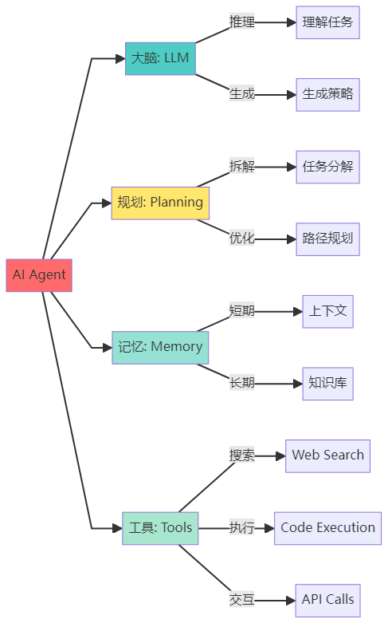

# 大模型Agent知识从0\-1笔记\-万字详解版本！

# 【Agent入门到实战】深度理解Agent全链路内容和深度优化、系统评估

---
## **什么是Agent？为什么说它是AI的下一个战场**

### 1\.1 从ChatGPT到Agent的进化

想象一下这个场景：

**传统的ChatGPT对话：**

- **你：「帮我规划一次周末去京都的旅行」**

- **ChatGPT：「当然！京都是个美丽的城市，你可以考虑参观清水寺、金阁寺\.\.\.建议提前预订酒店\.\.\.」**

- **你：（需要自己去各个网站查机票、订酒店、规划路线）**


**AI Agent的体验：**

- 你：「帮我规划一次周末去京都的旅行，预算5000元」

- Agent：（自动搜索机票价格）→（比较酒店并筛选）→（规划每日行程）→（计算预算）

- Agent：「已为您完成规划！往返机票1800元，住宿2晚1200元，包含清水寺、金阁寺等5个景点的详细行程，总预算4800元。\[查看完整计划\.pdf\]」

**这就是最本质的区别：ChatGPT给建议，Agent帮你干活。**

### 1\.2 Agent的核心定义

**AI Agent（智能体）** 是一个具备以下三大能力的智能系统：

1. **自主感知**：能够理解当前环境和任务需求

2. **自主决策**：能够制定执行计划并动态调整

3. **自主执行**：能够调用工具完成实际任务

**用一句话总结：Agent = LLM（大脑） \+ 工具（手脚） \+ 记忆（经验） \+ 规划（智慧）**

---

## Agent核心架构深度剖析

### 2\.1 Agent整体架构图

**让我们先看一张完整的Agent架构图，理解各个组件如何协同工作：**


### 2\.2 架构分层解析

这个架构可以分为**四个核心层**：

#### 第一层：感知层（Perception Layer）

- **作用**：接收并理解用户输入

- **组件**：用户输入 → 大语言模型理解

- **类比**：就像人的耳朵和眼睛

#### 第二层：认知层（Cognition Layer）

- **作用**：分析、推理、规划

- **组件**：LLM Brain \+ 规划模块 \+ 推理引擎

- **类比**：就像人的大脑

#### 第三层：执行层（Execution Layer）

- **作用**：调用各种工具完成任务

- **组件**：工具集（搜索、代码、API等）

- **类比**：就像人的手脚

#### 第四层：记忆层（Memory Layer）

- **作用**：存储和检索信息

- **组件**：短期记忆 \+ 长期记忆

- **类比**：就像人的记忆系统

### 2\.3 数据流转过程

让我用一个具体例子说明数据如何在架构中流转：

**任务**：「找出2024年诺贝尔物理学奖获得者，并总结他们的主要贡献」

```SQL
步骤1: 用户输入
   → 进入规划模块：识别需要「搜索」和「总结」两个步骤

步骤2: 规划完成
   → 进入推理引擎（ReAct框架）

步骤3: 第一轮思考-行动-观察循环
   Thought: "我需要搜索2024年诺贝尔物理学奖获得者"
   Action: 调用搜索工具search("2024 Nobel Prize Physics")
   Observation: 获得搜索结果→ "John Hopfield和Geoffrey Hinton"

步骤4: 第二轮思考-行动-观察循环
   Thought: "我需要了解他们的贡献"
   Action: 调用搜索工具search("Hopfield Hinton 神经网络贡献")
   Observation: 获得详细信息→ "人工神经网络和机器学习基础"

步骤5: 综合信息
   → LLM整合所有观察结果
   → 生成结构化答案
   → 存入记忆模块（长期记忆）

步骤6: 输出结果
   → 返回完整答案给用户
```

这个过程中，**Agent不是一次性生成答案**，而是**通过多轮思考\-行动\-观察的循环**，逐步接近最终答案。这就是Agent比传统LLM强大的地方。


## Agent的四大组成部分详解

### 3\.1 组成部分总览



### 3\.2 组成部分一：大语言模型（LLM Brain）

#### 作用与地位

LLM是Agent的「大脑」，负责：

- 理解用户意图

- 生成推理过程

- 决策选择工具

- 综合信息输出

#### 当前主流选择

#### 实际代码示例

```Python
from langchain_openai import ChatOpenAI

# 初始化LLM作为Agent的大脑
llm = ChatOpenAI(
    model="gpt-4",
    temperature=0,  # 降低随机性，提高推理稳定性
)

# LLM的推理能力展示
response = llm.invoke(
    "你需要查找2024年奥运会金牌榜，然后比较中美两国的金牌数。请分步思考如何完成这个任务。"
)
print(response.content)

# 输出示例：
# 思考步骤：
# 1. 首先需要调用搜索工具查找"2024奥运会金牌榜"
# 2. 从搜索结果中提取中国和美国的金牌数
# 3. 进行数值比较
# 4. 生成比较结果
```

**关键点**：

- `temperature=0`：让Agent在推理时更稳定、更可预测

- 提示词需要引导「分步思考」，这是CoT（Chain of Thought）的核心

### 3\.3 组成部分二：规划模块（Planning）

#### 为什么需要规划？

举个例子：如果任务是「帮我准备一场技术分享会」，没有规划的Agent会：

- 不知道从哪开始

- 可能遗漏重要步骤

- 浪费大量token重复思考

有规划的Agent会：

```Python
确定主题和目标听众
搜索相关技术资料
设计PPT大纲
准备演示Demo
生成演讲稿
```

#### 两种主流规划方法

**方法一：ReAct框架（边想边做）**


**ReAct特点**：

- ✅ 灵活：可以根据中间结果调整计划

- ✅ 适合探索性任务

- ❌ Token消耗大：每一步都要调用LLM

**方法二：Plan\-and\-Execute（先计划后执行）**


**Plan\-and\-Execute特点**：

- ✅ 高效：只需调用一次LLM规划

- ✅ 可并行执行多个任务

- ❌ 不灵活：难以根据中间结果调整

#### 实际代码对比

**ReAct实现**：

```Python
from langchain.agents import create_react_agent, AgentExecutor
from langchain.tools import Tool

# 定义工具
search_tool = Tool(
    name="Search",
    func=search_function,
    description="搜索互联网信息"
)

# 创建ReAct Agent
agent = create_react_agent(llm, [search_tool])
agent_executor = AgentExecutor(agent=agent, tools=[search_tool], verbose=True)

# 执行任务
result = agent_executor.invoke({
    "input": "找出DeepSeek-R1的训练成本，并与GPT-4对比"
})

# 输出过程（verbose=True会显示）：
# Thought: 我需要搜索DeepSeek-R1的信息
# Action: Search("DeepSeek-R1 training cost")
# Observation: [搜索结果]
# Thought: 接下来需要搜索GPT-4的成本
# Action: Search("GPT-4 training cost")
# Observation: [搜索结果]
# Thought: 现在可以进行对比了
# Final Answer: [对比结果]
```

**Plan\-and\-Execute实现**：

```Python
from langchain.agents import Plan, Execute

# 第一步：规划
planner = create_planner(llm)
plan = planner.plan("分析2024年AI Agent市场趋势")

# 输出的计划：
# Task 1: 搜索2024年AI Agent市场报告
# Task 2: 提取市场规模数据
# Task 3: 识别主要参与者
# Task 4: 总结趋势和预测

# 第二步：执行
executor = create_executor(tools)
results = executor.execute(plan)  # 按计划依次执行
```

#### 选择建议

- **探索性任务**（不知道中间会遇到什么）→ 用ReAct

- **流程明确的任务**（步骤固定）→ 用Plan\-and\-Execute

- **复杂混合任务** → 两者结合

### 3\.4 组成部分三：记忆模块（Memory）

#### 为什么记忆很重要？

想象你在和一个朋友聊天：

- **没有记忆**：每次对话都是新的，对方完全不记得你之前说过什么

- **有记忆**：对方记得你的喜好、之前的讨论，对话更流畅

Agent也一样。记忆分为两类：

#### 短期记忆（Short\-term Memory）

**作用**：保存当前任务的上下文

**存储内容**：

- 当前对话历史

- 中间步骤的结果

- 临时变量和状态

**技术实现**：

```Python
from langchain.memory import ConversationBufferMemory

# 创建对话记忆
memory = ConversationBufferMemory(
    memory_key="chat_history",
    return_messages=True
)

# Agent执行时自动记录
agent_executor = AgentExecutor(
    agent=agent,
    tools=tools,
    memory=memory,  # 添加记忆
    verbose=True
)

# 第一轮对话
agent_executor.invoke({"input": "我叫张三，在北京工作"})

# 第二轮对话（Agent会记得上下文）
agent_executor.invoke({"input": "帮我推荐北京的餐厅"})
# Agent会知道你在北京，直接推荐北京的餐厅
```

**短期记忆的挑战**：

- 📊 **Token限制**：GPT\-4有128K token限制，长对话会超出

- 💰 **成本问题**：每次调用都要把整个历史发送给LLM

**解决方案**：

```Python
from langchain.memory import ConversationSummaryMemory

# 使用摘要记忆：自动总结历史对话
summary_memory = ConversationSummaryMemory(
    llm=llm,
    max_token_limit=2000  # 超过限制时自动总结
)

# 效果：
# 原始历史（5000 tokens）→ 总结后（500 tokens）
# "用户是张三，在北京工作，偏好川菜，预算500元以内"
```

#### 长期记忆（Long\-term Memory）

**作用**：存储可复用的知识和经验

**存储内容**：

- 用户的个人信息和偏好

- 历史任务的成功经验

- 领域知识库

- 工具使用的最佳实践

**技术实现**：使用向量数据库

```Python
from langchain.vectorstores import Chroma
from langchain.embeddings import OpenAIEmbeddings

# 1. 创建向量数据库（长期记忆）
embeddings = OpenAIEmbeddings()
vectorstore = Chroma(
    collection_name="agent_memory",
    embedding_function=embeddings
)

# 2. 存储经验
vectorstore.add_texts([
    "用户张三偏好川菜，预算500元",
    "北京最佳川菜馆：川办、巴国布衣",
    "搜索餐厅时应该考虑：位置、评分、价格、口味"
])

# 3. Agent执行任务时检索相关记忆
query = "帮张三推荐餐厅"
relevant_memories = vectorstore.similarity_search(query, k=3)

# 4. 将记忆注入到prompt中
prompt = f"""
相关记忆：
{relevant_memories}

用户请求：{query}

请根据记忆中的信息给出推荐。
"""
```

#### 记忆架构图


#### 记忆模块的高级技巧

**技巧1：自动清理不重要的记忆**

```Python
#基于重要性评分的记忆管理
def should_store_in_long_term(message):
    # 让LLM判断是否重要
    importance = llm.predict(f"这条信息的重要性（1-10）：{message}")
    return int(importance) >= 7  # 只存储重要度>=7的信息
```

**技巧2：记忆的时效性管理**

```Python
#给记忆加上时间戳
from datetime import datetime, timedelta

memory_item = {
    "content": "用户偏好川菜",
    "timestamp": datetime.now(),
    "expiry": datetime.now() + timedelta(days=30)  # 30天后过期
}

# 检索时过滤过期记忆
def get_valid_memories():
    return [m for m in memories if m["expiry"] > datetime.now()]
```

### 3\.5 组成部分四：工具集（Tools）

#### 工具是Agent的「超能力」

如果说LLM是Agent的大脑，那工具就是Agent的「手脚」和「超能力」。通过工具，Agent可以：

- 🔍 搜索互联网

- 💻 执行代码

- 📊 操作数据库

- 🔧 调用API

- 🖥️ 控制电脑

#### 工具的定义与实现

**一个工具的标准结构**：

```Python
from langchain.tools import Tool

def calculate(expression: str) -> str:
    """执行数学计算"""
    try:
        result = eval(expression)  # 实际生产中不要用eval
        return f"计算结果：{result}"
    except Exception as e:
        return f"计算错误：{str(e)}"

# 定义工具
calculator_tool = Tool(
    name="Calculator",  # 工具名称（Agent会看到）
    func=calculate,     # 工具函数
    description="""
    用于数学计算。
    输入：数学表达式字符串，如 "2 + 2" 或 "sqrt(16)"
    输出：计算结果
    何时使用：当需要进行精确数学计算时
    """  # 描述很重要！Agent通过描述来决定是否使用该工具
)
```

**关键要素**：

1. **清晰的名称**：Agent通过名称快速识别工具

2. **详细的描述**：告诉Agent什么时候用、怎么用

3. **标准的输入输出**：保证工具能被正确调用

#### 常用工具类型与实现

1. **搜索工具**

```Python
from langchain.tools import DuckDuckGoSearchRun

search = DuckDuckGoSearchRun()

search_tool = Tool(
    name="WebSearch",
    func=search.run,
    description="搜索互联网获取最新信息。适用于需要实时数据的场景。"
)

# 使用示例
result = search.run("2024年诺贝尔物理学奖")
```

2. **代码执行工具**

```Python
def python_executor(code: str) -> str:
    """执行Python代码"""
    import io
    import sys
    from contextlib import redirect_stdout
    
    f = io.StringIO()
    try:
        with redirect_stdout(f):
            exec(code)
        return f.getvalue()
    except Exception as e:
        return f"错误：{str(e)}"

code_tool = Tool(
    name="PythonExecutor",
    func=python_executor,
    description="执行Python代码。适用于数据处理、计算、可视化等任务。"
)

# Agent可以这样用：
# code_tool.run("""
# import pandas as pd
# data = [1, 2, 3, 4, 5]
# print(f"平均值：{sum(data)/len(data)}")
# """)
```

3. **API调用工具**

```Python
import requests

def weather_api(city: str) -> str:
    """查询天气"""
    # 假设调用某个天气API
    response = requests.get(f"https://api.weather.com/{city}")
    return response.json()

weather_tool = Tool(
    name="WeatherAPI",
    func=weather_api,
    description="查询指定城市的天气信息。输入城市名，返回温度、湿度等信息。"
)
```

4. **数据库工具**

```Python
import sqlite3

def query_database(sql: str) -> str:
    """查询数据库"""
    conn = sqlite3.connect('my_database.db')
    cursor = conn.cursor()
    try:
        cursor.execute(sql)
        results = cursor.fetchall()
        return str(results)
    except Exception as e:
        return f"查询错误：{str(e)}"
    finally:
        conn.close()

db_tool = Tool(
    name="DatabaseQuery",
    func=query_database,
    description="执行SQL查询。适用于需要从数据库获取数据的场景。"
)
```

#### 工具组合的实际案例

**案例：构建一个数据分析Agent**

```Python
from langchain.agents import create_react_agent, AgentExecutor
from langchain_openai import ChatOpenAI

# 1. 准备工具集
tools = [
    search_tool,      # 搜索数据
    code_tool,        # 数据处理
    db_tool,          # 数据库查询
]

# 2. 创建Agent
llm = ChatOpenAI(model="gpt-4", temperature=0)
agent = create_react_agent(llm, tools)
agent_executor = AgentExecutor(agent=agent, tools=tools, verbose=True)

# 3. 执行复杂任务
result = agent_executor.invoke({
    "input": """
    帮我分析一下：
    1. 从数据库中查询2024年的销售数据
    2. 搜索行业平均增长率
    3. 用Python计算我们的增长率
    4. 对比并给出结论
    """
})

# Agent的执行过程：
# Thought: 需要先从数据库获取数据
# Action: DatabaseQuery("SELECT * FROM sales WHERE year=2024")
# Observation: [...数据...]
# 
# Thought: 需要搜索行业数据
# Action: WebSearch("2024年销售行业平均增长率")
# Observation: [...行业数据...]
# 
# Thought: 现在可以计算了
# Action: PythonExecutor("
#     our_growth = (current - previous) / previous * 100
#     industry_avg = 15.2
#     print(f'我们的增长率：{our_growth}%，行业平均：{industry_avg}%')
# ")
# Observation: 我们的增长率：18.5%，行业平均：15.2%
# 
# Thought: 可以给出结论了
# Final Answer: [完整分析报告]
```

#### 工具使用的最佳实践

**实践1：工具描述要精确**

❌ **不好的描述**：

```Python
description="一个搜索工具"
```

✅ **好的描述**：

```Python
description="""
搜索互联网获取最新信息。
- 输入：搜索关键词（字符串）
- 输出：相关网页内容摘要
- 适用场景：需要实时数据、最新新闻、当前事件
- 不适用场景：历史数据、个人信息、数学计算
"""
```

**实践2：工具要有错误处理**

```Python
def safe_tool(input_data):
    try:
        # 工具的实际逻辑
        result = process(input_data)
        return result
    except Exception as e:
        # 返回友好的错误信息，帮助Agent调整策略
        return f"工具执行失败：{str(e)}。建议：尝试其他方法或简化输入。"
```

**实践3：工具要有使用日志**

```Python
import logging

def logged_tool(input_data):
    logging.info(f"工具被调用，输入：{input_data}")
    result = execute(input_data)
    logging.info(f"工具执行完成，输出：{result}")
    return result
```

---

## Agent的工作原理与理解方式

### 4\.1 ReAct框架深度解析

ReAct（Reasoning \+ Acting）是目前最主流的Agent工作框架，由Google Brain研究团队提出。

#### ReAct的核心循环


#### 完整的ReAct示例

**任务**：「2024年哪个国家赢得了最多的奥运金牌？这个国家的首都是哪里？」

**Agent的完整思考过程**：

```YAML
=== 第一轮循环 ===

Thought 1:
"我需要找到2024年奥运会的金牌榜信息。这需要搜索最新的数据。"

Action 1:
Tool: WebSearch
Input: "2024奥运会金牌榜"

Observation 1:
"2024年巴黎奥运会，美国队以40枚金牌位居榜首，中国队38枚金牌第二..."

=== 第二轮循环 ===

Thought 2:
"好的，美国赢得了最多的金牌。现在我需要确认美国的首都。虽然我知道是华盛顿D.C.，但为了确保准确性，我应该验证一下。"

Action 2:
Tool: WebSearch
Input: "美国首都"

Observation 2:
"美国的首都是华盛顿哥伦比亚特区（Washington, D.C.）..."

=== 完成 ===

Thought 3:
"我已经获得了所有需要的信息，可以回答了。"

Final Answer:
"2024年巴黎奥运会，美国赢得了最多的金牌（40枚）。美国的首都是华盛顿哥伦比亚特区（Washington, D.C.）。"
```

#### ReAct的代码实现

```Python
from langchain.agents import create_react_agent, AgentExecutor
from langchain_openai import ChatOpenAI
from langchain.tools import Tool
from langchain.prompts import PromptTemplate

# 1. 定义ReAct的提示词模板
react_prompt = PromptTemplate.from_template("""
你是一个AI助手，通过推理和行动来解决问题。

可用工具：
{tools}

使用以下格式：

Question: 需要回答的问题
Thought: 你应该思考该做什么
Action: 要采取的行动，必须是[{tool_names}]之一
Action Input: 行动的输入
Observation: 行动的结果
... (这个Thought/Action/Action Input/Observation可以重复N次)
Thought: 我现在知道最终答案了
Final Answer: 原始问题的最终答案

开始！

Question: {input}
Thought: {agent_scratchpad}
""")

# 2. 创建工具
def search(query):
    # 简化的搜索实现
    if "金牌" in query:
        return "2024年巴黎奥运会美国队40枚金牌第一"
    elif "首都" in query:
        return "美国首都是华盛顿D.C."

search_tool = Tool(
    name="Search",
    func=search,
    description="搜索互联网信息"
)

# 3. 创建Agent
llm = ChatOpenAI(model="gpt-4", temperature=0)
agent = create_react_agent(
    llm=llm,
    tools=[search_tool],
    prompt=react_prompt
)

agent_executor = AgentExecutor(
    agent=agent,
    tools=[search_tool],
    verbose=True,  # 显示详细过程
    max_iterations=5  # 最多5轮循环
)

# 4. 执行任务
result = agent_executor.invoke({
    "input": "2024年哪个国家赢得了最多的奥运金牌？这个国家的首都是哪里？"
})

print(result["output"])
```

### 4\.2 其他Agent工作模式

除了ReAct，还有其他几种重要的工作模式：

#### 模式1：Chain of Thought \(CoT\) \- 纯推理


**特点**：

- 只有思考，没有行动

- 适合纯逻辑推理问题

- Token消耗少

**示例**：

```Python
问题："如果一个房间有3只猫，每只猫前面有2只猫，那一共有多少只猫？"

CoT推理：
思考1：题目说"每只猫前面有2只猫"
思考2：这意味着猫排成一排
思考3：但只有3只猫，所以是循环的或者交叉的排列
思考4：实际上还是3只猫
答案：3只猫
```

#### 模式2：Plan\-and\-Execute \- 先计划后执行


**特点**：

- 先一次性规划，再按计划执行

- 可以并行执行任务

- 适合流程明确的复杂任务

**代码示例**：

```Bash
#1. 规划阶段
planner_prompt = """
将任务分解为子任务：
任务：{task}

请输出JSON格式的任务列表：
[
    {"id": 1, "description": "...", "dependencies": []},
    {"id": 2, "description": "...", "dependencies": [1]},
    ...
]
"""

plan = llm.invoke(planner_prompt.format(
    task="分析竞争对手的产品策略"
))

# 2. 执行阶段
for task in plan:
    if all_dependencies_completed(task):
        result = execute_task(task)
        store_result(task.id, result)
```

#### 模式3：Self\-Ask \- 自问自答


**示例**：

```Python
主问题："iPhone 15的屏幕比iPhone 14大多少？"

Agent自问自答：
Q1: "iPhone 15的屏幕尺寸是多少？"
→ 搜索得到：6.1英寸

Q2: "iPhone 14的屏幕尺寸是多少？"
→ 搜索得到：6.1英寸

Q3: "6.1英寸 - 6.1英寸 = ?"
→ 计算得到：0英寸

最终答案："iPhone 15和iPhone 14的屏幕尺寸相同，都是6.1英寸。"
```

### 4\.3 理解Agent的三种视角

#### 视角1：把Agent看作「员工」

```Python
你（老板）：「帮我准备明天的演讲PPT」

Agent（员工）：
理解需求（演讲主题、目标听众）
搜索资料（行业数据、案例）
设计大纲（结构规划）
制作PPT（使用工具）
审核优化（自我检查）
交付成果（PPT文件）
```

**这个视角帮助你**：

- 设计Agent的职责范围

- 定义输入输出格式

- 考虑错误处理

#### 视角2：把Agent看作「循环系统」

```Python
输入 → [感知 → 思考 → 决策 → 行动 → 观察] → 输出
         ↑_______________________________|
              反馈循环
```

**这个视角帮助你**：

- 优化循环次数

- 设置终止条件

- 调试中间过程

#### 视角3：把Agent看作「大脑\+工具」

```Python
大脑（LLM）：
    理解语言
    推理规划
    生成文本

↕ 通信

工具箱：
    搜索引擎
    计算器
    API接口
    数据库
```

**这个视角帮助你**：

- 扩展Agent能力（添加新工具）

- 优化工具选择（描述要精确）

- 提升执行效率（工具要快）


## 构建Agent的五大难点与解决方案

### 5\.1 难点一：无限循环与任务卡死

#### 问题描述

Agent可能陷入死循环：

```YAML
Thought: 我需要搜索信息
Action: Search("2024 AI")
Observation: [搜索结果]

Thought: 我需要搜索更详细的信息
Action: Search("2024 AI详细")
Observation: [搜索结果]

Thought: 我需要搜索更详细的信息
Action: Search("2024 AI更详细")
...（永远循环）
```

#### 解决方案

**方案1：设置最大迭代次数**

```Python
agent_executor = AgentExecutor(
    agent=agent,
    tools=tools,
    max_iterations=10,  # 最多执行10轮
    max_execution_time=60,  # 最多执行60秒
    early_stopping_method="generate"  # 超时时生成答案
)
```

**方案2：优化提示词，明确终止条件**

```Python
prompt = """
你必须在5步内完成任务。
如果5步内无法完成，请给出"基于现有信息的最佳答案"。

当前已经执行了{iterations}步。
"""
```

**方案3：实现智能终止判断**

```Python
def should_continue(agent_state):
    # 检查是否在重复相同的行动
    last_3_actions = agent_state.history[-3:]
    if len(set(last_3_actions)) == 1:  # 最后3个动作都相同
        return False  # 终止
    
    # 检查是否进展缓慢
    if agent_state.iterations > 5 and not has_new_info(agent_state):
        return False
    
    return True
```

### 5\.2 难点二：工具选择错误

#### 问题描述

```Python
Agent选择了错误的工具：
任务："计算2024年有多少天"

错误选择：
Action: WebSearch("2024年有多少天")  ❌ 不需要搜索

正确选择：
Action: Calculator("365 if not is_leap_year(2024) else 366")  ✅
```

#### 根本原因

1. 工具描述不清晰

2. Prompt没有给出使用规则

3. LLM对任务理解有偏差

#### 解决方案

**方案1：改进工具描述**

```Python
❌ 不好的描述
calculator_tool = Tool(
    name="Calculator",
    description="计算"
)

# ✅ 好的描述
calculator_tool = Tool(
    name="Calculator",
    description="""
    用于精确的数学计算。
    
    适用场景：
    - 算术运算（加减乘除）
    - 数学函数（平方、开方、三角函数）
    - 逻辑判断（比较大小）
    
    输入格式：Python数学表达式字符串
    示例："2 + 2", "sqrt(16)", "2024 % 4 == 0"
    
    不适用场景：
    - 需要最新数据（用Search）
    - 需要上下文信息（用Memory）
    """
)
```

**方案2：添加工具使用示例**

```Python
prompt = """
工具使用示例：

问题："今天的天气如何？"
正确：Action: WeatherAPI("北京")
错误：Action: Calculator("天气")  # 天气不是数学问题

问题："2的100次方是多少？"
正确：Action: Calculator("2**100")
错误：Action: Search("2的100次方")  # 不需要搜索

现在请处理：{input}
"""
```

**方案3：实现工具推荐系统**

```Python
def recommend_tool(task_description, available_tools):
    """根据任务描述推荐工具"""
    # 使用LLM分析任务
    analysis = llm.invoke(f"""
    任务：{task_description}
    
    请分析这个任务需要：
    1. 实时数据吗？→ 需要Search
    2. 数学计算吗？→ 需要Calculator
    3. 历史信息吗？→ 需要Memory
    
    推荐工具（JSON格式）：
    {{"recommended": ["tool1", "tool2"], "reason": "..."}}
    """)
    
    return analysis.recommended
```

### 5\.3 难点三：上下文窗口溢出

#### 问题描述

长对话或复杂任务会导致：

```Python
Prompt + 历史对话 + 工具描述 + 中间结果 = 超过Token限制

GPT-4: 128K tokens
Claude: 200K tokens

一次复杂任务可能消耗50K+ tokens
→ 超出限制或成本过高
```

#### 解决方案

**方案1：智能压缩上下文**

```Python
from langchain.memory import ConversationSummaryBufferMemory

memory = ConversationSummaryBufferMemory(
    llm=llm,
    max_token_limit=4000,  # 保留最近4000 tokens
    moving_summary_buffer="",  # 旧的对话自动总结
)

# 效果：
# 旧对话："用户询问了天气、新闻、股票...共20轮对话"
# ↓ 总结为
# "用户主要关心北京天气（晴）、今日新闻（AI发展）、股票（上涨）"
```

**方案2：分层记忆**

```Python
class HierarchicalMemory:
    def init(self):
        self.recent_memory = []  # 最近3轮，完整保留
        self.mid_term_memory = []  # 中期10轮，保留关键信息
        self.long_term_memory = vectorstore  # 长期，向量检索
    
    def add(self, message):
        self.recent_memory.append(message)
        
        if len(self.recent_memory) > 3:
            # 移到中期记忆，提取关键信息
            old_message = self.recent_memory.pop(0)
            key_info = extract_key_info(old_message)
            self.mid_term_memory.append(key_info)
        
        if len(self.mid_term_memory) > 10:
            # 移到长期记忆，存入向量库
            old_info = self.mid_term_memory.pop(0)
            self.long_term_memory.add_texts([old_info])
    
    def get_context(self, query):
        # 组合三层记忆
        recent = "\n".join(self.recent_memory)
        mid = "\n".join(self.mid_term_memory)
        relevant = self.long_term_memory.similarity_search(query, k=2)
        
        return f"{recent}\n\n相关历史：{mid}\n{relevant}"
```

**方案3：动态工具加载**

```Python
#不要一次性加载所有工具
all_tools = {
    "search": search_tool,
    "calculator": calc_tool,
    "database": db_tool,
    "api": api_tool,
    # ... 50个工具
}

# 根据任务动态选择工具
def select_tools(task):
    # 分析任务需要哪些类别的工具
    if "搜索" in task or "查询" in task:
        return [all_tools["search"]]
    elif "计算" in task:
        return [all_tools["calculator"]]
    # ...
    
    # 默认返回最常用的5个工具
    return list(all_tools.values())[:5]

# 创建Agent时只加载需要的工具
tools = select_tools(user_input)
agent = create_agent(llm, tools)
```

### 5\.4 难点四：错误处理与鲁棒性

#### 问题描述

各种错误会导致Agent崩溃：

- 工具调用失败

- API超时

- 返回格式错误

- LLM输出异常

#### 解决方案

**方案1：工具层面的错误处理**

```Python
def robust_tool(func):
    """装饰器：让工具更健壮"""
    def wrapper(*args, **kwargs):
        max_retries = 3
        for attempt in range(max_retries):
            try:
                result = func(*args, **kwargs)
                return {
                    "success": True,
                    "data": result
                }
            except TimeoutError:
                if attempt == max_retries - 1:
                    return {
                        "success": False,
                        "error": "工具执行超时，请尝试简化输入或使用其他工具"
                    }
                time.sleep(2 ** attempt)  # 指数退避
            except Exception as e:
                return {
                    "success": False,
                    "error": f"工具执行失败：{str(e)}"
                }
    return wrapper

@robust_tool
def search_tool(query):
    # 实际搜索逻辑
    return search_engine.query(query)
```

**方案2：Agent层面的降级策略**

```Python
class RobustAgent:
    def execute(self, task):
        try:
            # 尝试完整流程
            return self.full_execution(task)
        except AgentError:
            # 降级：使用简化流程
            return self.simplified_execution(task)
        except Exception:
            # 最终降级：直接用LLM回答
            return self.fallback_execution(task)
    
    def full_execution(self, task):
        # ReAct完整循环，可能使用多个工具
        return self.react_loop(task)
    
    def simplified_execution(self, task):
        # 简化版：只用一个最重要的工具
        tool = self.select_best_tool(task)
        result = tool.run(task)
        return self.llm.summarize(result)
    
    def fallback_execution(self, task):
        # 保底：直接用LLM知识回答
        return self.llm.invoke(f"请基于你的知识回答：{task}")
```

**方案3：实时监控与告警**

```Python
import logging

class AgentMonitor:
    def init(self):
        self.metrics = {
            "total_tasks": 0,
            "success": 0,
            "failures": 0,
            "avg_time": 0,
        }
    
    def log_execution(self, task, result, duration):
        self.metrics["total_tasks"] += 1
        
        if result["success"]:
            self.metrics["success"] += 1
        else:
            self.metrics["failures"] += 1
            logging.error(f"Task failed: {task}, Error: {result['error']}")
        
        # 计算平均时间
        self.metrics["avg_time"] = (
            self.metrics["avg_time"] * (self.metrics["total_tasks"] - 1) + duration
        ) / self.metrics["total_tasks"]
        
        # 告警
        failure_rate = self.metrics["failures"] / self.metrics["total_tasks"]
        if failure_rate > 0.3:  # 失败率超过30%
            send_alert(f"Agent failure rate: {failure_rate:.2%}")
```

### 5\.5 难点五：成本控制

#### 问题描述

Agent的成本可能很高：

```Bash
一次复杂任务：
10轮ReAct循环
每轮2K tokens输入 + 500 tokens输出
总计：(2000+500) * 10 = 25K tokens

GPT-4价格（假设）：
输入：$0.03 / 1K tokens
输出：$0.06 / 1K tokens

单次任务成本：
输入：20K * 0.03 = $0.60
输出：5K * 0.06 = $0.30
总计：$0.90

如果每天1000个任务 = $900/天 = $27,000/月
```

#### 解决方案

**方案1：模型分级使用**

```Python
class CostOptimizedAgent:
    def init(self):
        self.models = {
            "cheap": ChatOpenAI(model="gpt-3.5-turbo"),  # $0.002/1K
            "standard": ChatOpenAI(model="gpt-4"),        # $0.03/1K
            "premium": ChatOpenAI(model="gpt-4-turbo"),   # $0.01/1K
        }
    
    def select_model(self, task_complexity):
        # 简单任务用便宜模型
        if task_complexity < 3:
            return self.models["cheap"]
        elif task_complexity < 7:
            return self.models["standard"]
        else:
            return self.models["premium"]
    
    def estimate_complexity(self, task):
        # 根据任务特征估计复杂度
        factors = {
            "num_steps": len(parse_steps(task)) * 2,
            "need_tools": 3 if requires_tools(task) else 0,
            "domain_specific": 2 if is_specialized(task) else 0,
        }
        return sum(factors.values())
```

**方案2：缓存机制**

```Python
from functools import lru_cache
import hashlib

class CachedAgent:
    def init(self):
        self.cache = {}
    
    def execute(self, task):
        # 计算任务的哈希值
        task_hash = hashlib.md5(task.encode()).hexdigest()
        
        # 检查缓存
        if task_hash in self.cache:
            logging.info(f"Cache hit for task: {task[:50]}...")
            return self.cache[task_hash]
        
        # 执行任务
        result = self.agent.run(task)
        
        # 存入缓存
        self.cache[task_hash] = result
        return result

# 效果：
# 第一次："北京明天天气" → 调用LLM → 成本$0.05
# 第二次："北京明天天气" → 从缓存读取 → 成本$0
```

**方案3：批处理**

```Python
def batch_process(tasks):
    """批量处理相似任务"""
    # 将相似任务分组
    groups = group_similar_tasks(tasks)
    
    results = []
    for group in groups:
        # 一次性处理一组任务
        batch_prompt = f"""
        请处理以下{len(group)}个相似任务：
        {"\n".join([f"{i+1}. {t}" for i, t in enumerate(group)])}
        
        请输出JSON格式的结果列表。
        """
        
        batch_result = llm.invoke(batch_prompt)
        results.extend(parse_batch_result(batch_result))
    
    return results

# 效果：
# 单独处理10个任务：10次LLM调用
# 批量处理10个任务：2-3次LLM调用（节省70%成本）
```

**方案4：设置预算限制**

```Python
class BudgetControlledAgent:
    def init(self, daily_budget_usd=10):
        self.daily_budget = daily_budget_usd
        self.today_spent = 0
        self.task_count = 0
    
    def execute(self, task):
        # 检查预算
        estimated_cost = self.estimate_cost(task)
        if self.today_spent + estimated_cost > self.daily_budget:
            return {
                "success": False,
                "message": f"预算不足。今日已用${self.today_spent:.2f}，预算${self.daily_budget}"
            }
        
        # 执行任务
        result = self.agent.run(task)
        actual_cost = self.calculate_cost(result.tokens_used)
        
        # 更新统计
        self.today_spent += actual_cost
        self.task_count += 1
        
        logging.info(f"Task {self.task_count}: Cost ${actual_cost:.4f}, Total ${self.today_spent:.2f}")
        
        return result
```

---

## 多Agent协同系统设计

### 6\.1 为什么需要多Agent？

单个Agent的局限性：

```Python
假设你要开发一个完整的软件产品：

单Agent模式：
Agent：「我既要写需求文档，又要写代码，还要测试，还要设计UI...」
→ 能力有限
→ 容易出错
→ 效率低下

多Agent模式：
产品经理Agent：负责需求分析
架构师Agent：负责系统设计
开发Agent：负责编写代码
测试Agent：负责质量保证
UI设计Agent：负责界面设计

→ 专业分工
→ 并行工作
→ 质量更高
```

### 6\.2 多Agent系统架构


### 6\.3 多Agent协作模式

#### 模式1：层级结构（Hierarchical）


**特点**：

- 有明确的上下级关系

- 管理者负责任务分配和结果整合

- 适合层次清晰的任务

**代码实现**：

```Python
from langchain.agents import Agent
from langchain_openai import ChatOpenAI

class ManagerAgent:
    def init(self):
        self.llm = ChatOpenAI(model="gpt-4")
        self.workers = {
            "researcher": ResearcherAgent(),
            "analyst": AnalystAgent(),
            "writer": WriterAgent(),
        }
    
    def delegate(self, task):
        # 分析任务，分配给合适的worker
        plan = self.llm.invoke(f"""
        任务：{task}
        
        请将任务分解并分配给以下worker：
        - researcher: 负责搜集信息
        - analyst: 负责数据分析
        - writer: 负责内容创作
        
        输出JSON格式的任务分配：
        [
            {{"worker": "researcher", "subtask": "..."}},
            {{"worker": "analyst", "subtask": "..."}},
            ...
        ]
        """)
        
        # 分配任务
        results = {}
        for subtask in plan:
            worker_name = subtask["worker"]
            worker = self.workers[worker_name]
            results[worker_name] = worker.execute(subtask["subtask"])
        
        # 整合结果
        return self.integrate_results(results)
    
    def integrate_results(self, results):
        # 让LLM整合各个worker的结果
        combined = self.llm.invoke(f"""
        请整合以下各部分的结果：
        
        研究结果：{results['researcher']}
        分析结果：{results['analyst']}
        创作结果：{results['writer']}
        
        输出最终完整的报告。
        """)
        return combined

# 使用
manager = ManagerAgent()
result = manager.delegate("分析2024年AI Agent市场趋势并撰写报告")
```

#### 模式2：平等协作（Collaborative）


**特点**：

- Agents地位平等

- 可以相互协商和讨论

- 适合需要多角度思考的复杂问题

**代码实现（AutoGen风格）**：

```Python
from autogen import ConversableAgent

# 定义三个平等的Agent
researcher = ConversableAgent(
    name="Researcher",
    system_message="你是一个研究员，负责收集和验证信息。",
    llm_config={"model": "gpt-4"},
)

critic = ConversableAgent(
    name="Critic",
    system_message="你是一个评论家，负责质疑和改进方案。",
    llm_config={"model": "gpt-4"},
)

writer = ConversableAgent(
    name="Writer",
    system_message="你是一个作家，负责组织和表达信息。",
    llm_config={"model": "gpt-4"},
)

# Agents之间的对话
def collaborative_work(task):
    # Round 1: Researcher提供初步信息
    research_result = researcher.generate_reply(
        messages=[{"role": "user", "content": task}]
    )
    
    # Round 2: Critic评价和建议
    critique = critic.generate_reply(
        messages=[
            {"role": "user", "content": task},
            {"role": "assistant", "content": research_result},
        ]
    )
    
    # Round 3: Writer整合并输出
    final_output = writer.generate_reply(
        messages=[
            {"role": "user", "content": task},
            {"role": "assistant", "content": research_result},
            {"role": "assistant", "content": critique},
        ]
    )
    
    return final_output

result = collaborative_work("设计一个AI Agent产品的营销策略")
```

#### 模式3：流水线（Pipeline）


**特点**：

- 固定的处理顺序

- 每个Agent专注于流程中的一个阶段

- 适合有明确步骤的任务

**实际案例：内容创作流水线**

```Python
class ContentPipeline:
    def init(self):
        self.stages = [
            ResearchAgent(),    # 阶段1：研究
            OutlineAgent(),     # 阶段2：大纲
            DraftAgent(),       # 阶段3：草稿
            EditorAgent(),      # 阶段4：编辑
            SEOAgent(),         # 阶段5：SEO优化
        ]
    
    def process(self, topic):
        data = {"topic": topic}
        
        for stage in self.stages:
            print(f"执行阶段：{stage.name}")
            data = stage.execute(data)
            print(f"输出：{data[:100]}...\n")
        
        return data

# 定义各阶段的Agent
class ResearchAgent:
    name = "Research"
    def execute(self, data):
        # 搜索相关资料
        sources = search(data["topic"])
        data["sources"] = sources
        return data

class OutlineAgent:
    name = "Outline"
    def execute(self, data):
        # 基于sources生成大纲
        outline = generate_outline(data["sources"])
        data["outline"] = outline
        return data

class DraftAgent:
    name = "Draft"
    def execute(self, data):
        # 基于outline写草稿
        draft = write_draft(data["outline"])
        data["draft"] = draft
        return data

class EditorAgent:
    name = "Editor"
    def execute(self, data):
        # 润色和改进草稿
        edited = edit_content(data["draft"])
        data["final_content"] = edited
        return data

class SEOAgent:
    name = "SEO"
    def execute(self, data):
        # 优化SEO
        optimized = add_seo_keywords(data["final_content"])
        data["seo_content"] = optimized
        return data

# 使用流水线
pipeline = ContentPipeline()
article = pipeline.process("AI Agent的商业应用")
```

### 6\.4 多Agent的实战案例

#### 案例：智能软件开发团队

```Python
class SoftwareDevelopmentTeam:
    def init(self):
        # 定义团队成员
        self.agents = {
            "pm": ProductManagerAgent(),      # 产品经理
            "architect": ArchitectAgent(),    # 架构师
            "frontend": FrontendAgent(),      # 前端开发
            "backend": BackendAgent(),        # 后端开发
            "tester": TesterAgent(),          # 测试工程师
            "reviewer": CodeReviewerAgent(),  # 代码审查
        }
        
        self.coordinator = CoordinatorAgent()
    
    def develop(self, requirement):
        """完整的开发流程"""
        
        # 步骤1：产品经理分析需求
        print("📋 产品经理分析需求...")
        prd = self.agents["pm"].analyze_requirement(requirement)
        
        # 步骤2：架构师设计系统
        print("🏗️ 架构师设计系统...")
        architecture = self.agents["architect"].design_system(prd)
        
        # 步骤3：前后端并行开发
        print("💻 开发中...")
        from concurrent.futures import ThreadPoolExecutor
        
        with ThreadPoolExecutor(max_workers=2) as executor:
            frontend_future = executor.submit(
                self.agents["frontend"].develop,
                architecture["frontend_spec"]
            )
            backend_future = executor.submit(
                self.agents["backend"].develop,
                architecture["backend_spec"]
            )
            
            frontend_code = frontend_future.result()
            backend_code = backend_future.result()
        
        # 步骤4：代码审查
        print("🔍 代码审查...")
        review_result = self.agents["reviewer"].review({
            "frontend": frontend_code,
            "backend": backend_code,
        })
        
        if not review_result["passed"]:
            print("⚠️ 代码审查未通过，需要修改...")
            # 递归修改，直到通过
            return self.develop(requirement)  # 简化示例
        
        # 步骤5：测试
        print("🧪 测试中...")
        test_result = self.agents["tester"].test({
            "frontend": frontend_code,
            "backend": backend_code,
        })
        
        if not test_result["passed"]:
            print("❌ 测试失败，修复bug...")
            # 修复并重新测试
            return self.develop(requirement)  # 简化示例
        
        # 步骤6：部署
        print("✅ 开发完成！")
        return {
            "prd": prd,
            "architecture": architecture,
            "code": {
                "frontend": frontend_code,
                "backend": backend_code,
            },
            "test_report": test_result,
        }

# 使用
team = SoftwareDevelopmentTeam()
result = team.develop("开发一个AI聊天机器人网站")

# 输出示例：
# 📋 产品经理分析需求...
# 🏗️ 架构师设计系统...
# 💻 开发中...
# 🔍 代码审查...
# 🧪 测试中...
# ✅ 开发完成！
```

### 6\.5 多Agent的关键挑战

#### 挑战1：通信开销

多个Agent之间需要频繁通信：

```Python
#问题：每次通信都要调用LLM
Agent1 → LLM → Agent2 → LLM → Agent3
成本和延迟都很高

# 解决：使用结构化消息
class Message:
    def init(self, sender, receiver, content, message_type):
        self.sender = sender
        self.receiver = receiver
        self.content = content  # 结构化数据，不需要LLM理解
        self.type = message_type  # "task", "result", "question"
    
    def to_dict(self):
        return {
            "from": self.sender,
            "to": self.receiver,
            "content": self.content,
            "type": self.type,
        }

# Agent直接处理结构化消息，只在必要时调用LLM
```

#### 挑战2：死锁和循环依赖

```Python
#问题：两个Agent互相等待
Agent1：等待Agent2的结果...
Agent2：等待Agent1的结果...
→ 死锁

# 解决：超时和fallback机制
class AgentCommunicator:
    def send_and_wait(self, target_agent, message, timeout=30):
        start_time = time.time()
        
        # 发送消息
        target_agent.receive(message)
        
        # 等待响应
        while time.time() - start_time < timeout:
            if target_agent.has_response():
                return target_agent.get_response()
            time.sleep(0.1)
        
        # 超时处理
        return {"error": "Timeout", "fallback": "使用默认值"}
```

#### 挑战3：结果冲突

```Python
#问题：不同Agent给出不同的答案
Agent1: "这个方案可行"
Agent2: "这个方案有风险"
Agent3: "这个方案成本太高"

# 解决：投票或仲裁机制
class ConflictResolver:
    def resolve(self, opinions):
        # 方法1：投票
        votes = {"agree": 0, "disagree": 0}
        for opinion in opinions:
            if opinion["stance"] == "positive":
                votes["agree"] += opinion["confidence"]
            else:
                votes["disagree"] += opinion["confidence"]
        
        if votes["agree"] > votes["disagree"]:
            return "采纳方案"
        else:
            return "否决方案"
        
        # 方法2：专家仲裁
        expert = ExpertAgent()
        final_decision = expert.judge(opinions)
        return final_decision
```

---

## 主流Agent开发框架对比

### 7\.1 框架总览对比

### 7\.2 LangChain深度解析

#### 核心概念

```Python
from langchain.agents import create_react_agent, AgentExecutor
from langchain_openai import ChatOpenAI
from langchain.tools import Tool
from langchain.prompts import PromptTemplate

# 1. LLM：大脑
llm = ChatOpenAI(model="gpt-4", temperature=0)

# 2. Tools：工具
tools = [
    Tool(
        name="Search",
        func=search_function,
        description="搜索互联网信息"
    ),
    Tool(
        name="Calculator",
        func=calculator_function,
        description="执行数学计算"
    ),
]

# 3. Prompt：指令模板
prompt = PromptTemplate.from_template("""
你是一个AI助手。使用以下工具来回答问题：
{tools}

格式：
Question: {input}
Thought: 思考过程
Action: 工具名称
Action Input: 工具输入
Observation: 工具输出
... (重复)
Thought: 我现在知道答案了
Final Answer: 最终答案

Question: {input}
{agent_scratchpad}
""")

# 4. Agent：组装
agent = create_react_agent(llm, tools, prompt)

# 5. Executor：执行器
agent_executor = AgentExecutor(
    agent=agent,
    tools=tools,
    verbose=True,
    max_iterations=5,
)

# 6. 执行
result = agent_executor.invoke({"input": "2024年AI Agent市场规模是多少？"})
```

#### LangChain的优势

```Python
#优势1：丰富的集成
from langchain.vectorstores import Chroma
from langchain.embeddings import OpenAIEmbeddings
from langchain.text_splitter import RecursiveCharacterTextSplitter
from langchain.document_loaders import WebBaseLoader

#一站式RAG方案
loader = WebBaseLoader("https://example.com/article")
documents = loader.load()

text_splitter = RecursiveCharacterTextSplitter(chunk_size=1000)
chunks = text_splitter.split_documents(documents)

vectorstore = Chroma.from_documents(
    documents=chunks,
    embedding=OpenAIEmbeddings()
)

#优势2：灵活的链式组合
from langchain.chains import LLMChain

chain = (
    prompt
    | llm
    | output_parser
)

#优势3：强大的记忆管理
from langchain.memory import ConversationBufferWindowMemory

memory = ConversationBufferWindowMemory(k=5)  # 保留最近5轮对话
```

### 7\.3 AutoGen多Agent协作

#### AutoGen的特色

```Python
from autogen import ConversableAgent, GroupChat, GroupChatManager

#定义多个Agent
product_manager = ConversableAgent(
    name="PM",
    system_message="你是产品经理，负责需求分析和产品规划。",
    llm_config={"model": "gpt-4"},
)

engineer = ConversableAgent(
    name="Engineer",
    system_message="你是工程师，负责技术实现。",
    llm_config={"model": "gpt-4"},
)

designer = ConversableAgent(
    name="Designer",
    system_message="你是设计师，负责UI/UX设计。",
    llm_config={"model": "gpt-4"},
)

#创建群聊
group_chat = GroupChat(
    agents=[product_manager, engineer, designer],
    messages=[],
    max_round=10,
)

#管理者
manager = GroupChatManager(
    groupchat=group_chat,
    llm_config={"model": "gpt-4"},
)

#开始协作
product_manager.initiate_chat(
    manager,
    message="我们需要开发一个AI聊天应用，大家讨论一下方案。",
)

#输出示例：
#PM: "我建议使用WebSocket实现实时通信..."
#Engineer: "技术上可行，我可以用FastAPI+WebSocket实现..."
#Designer: "UI应该简洁，参考Slack的设计..."
#PM: "同意，我们先做MVP..."
#...
```

#### AutoGen的并行执行

```Python
#多个Agent同时工作
from autogen import UserProxyAgent

user_proxy = UserProxyAgent(
    name="User",
    human_input_mode="NEVER",  # 不需要人工输入
    code_execution_config={"work_dir": "workspace"},
)

#并行任务
tasks = [
    "搜索2024年AI发展趋势",
    "分析主要竞争对手",
    "设计产品架构",
]

import asyncio

async def parallel_execution():
    results = await asyncio.gather(*[
        agent.a_generate_reply({"content": task})
        for task in tasks
    ])
    return results
```

### 7\.4 CrewAI角色扮演框架

#### CrewAI的团队概念

```Python
from crewai import Agent, Task, Crew

#定义角色
researcher = Agent(
    role="Research Analyst",
    goal="发现AI Agent领域的最新趋势",
    backstory="你是一个经验丰富的AI研究分析师...",
    tools=[search_tool],
    verbose=True,
)

writer = Agent(
    role="Content Writer",
    goal="撰写吸引人的技术文章",
    backstory="你是一个技术作家，擅长将复杂概念简化...",
    tools=[],
    verbose=True,
)

#定义任务
task1 = Task(
    description="研究2024年AI Agent的市场趋势",
    agent=researcher,
    expected_output="详细的市场分析报告",
)

task2 = Task(
    description="基于研究结果撰写一篇博客文章",
    agent=writer,
    expected_output="1500字的博客文章",
)

#组建团队
crew = Crew(
    agents=[researcher, writer],
    tasks=[task1, task2],
    verbose=True,
    process="sequential",  # 顺序执行
)

#启动
result = crew.kickoff()
```

### 7\.5 Dify可视化平台

#### Dify的工作流编排

```Python
[用户输入]
    ↓
[LLM节点: 理解意图]
    ↓
[条件分支]
    ├─ 需要搜索 → [搜索节点] → [LLM节点: 总结]
    └─ 不需要搜索 → [LLM节点: 直接回答]
    ↓
[输出节点]
```

**Dify的优势**：

- ✅ 拖拽式设计，无需代码

- ✅ 内置RAG、Agent、工作流模板

- ✅ 可视化调试和监控

- ✅ 一键部署API

**适用场景**：

- 快速原型验证

- 业务人员使用

- 低代码场景

### 7\.6 框架选择指南

```Python
def choose_framework(scenario):
    if scenario == "学习和探索":
        return "LangChain - 生态最完善，教程最多"
    elif scenario == "多Agent协作":
        return "AutoGen - 专为多Agent设计"
    elif scenario == "团队流程模拟":
        return "CrewAI - 角色扮演最自然"
    elif scenario == "快速原型":
        return "Dify - 可视化，上手快"
    elif scenario == "国内部署":
        return "LazyLLM - 中文优化，商汤支持"
    elif scenario == "生产级应用":
        return "LangChain + 自定义优化"
    else:
        return "LangChain - 最保险的选择"
```

---

## Agent实战案例与代码实现

### 8\.1 案例一：智能客服Agent

#### 需求分析

```Python
场景：电商平台的客服系统

功能要求：
回答常见问题（FAQ）
查询订单状态
处理退换货
转人工客服（复杂问题）
技术挑战：
需要访问数据库（订单系统）
需要记忆上下文（多轮对话）
需要情感识别（判断用户情绪）
```

#### 完整实现

```Python
from langchain.agents import create_react_agent, AgentExecutor
from langchain_openai import ChatOpenAI
from langchain.tools import Tool
from langchain.memory import ConversationBufferMemory
import sqlite3

# 1. 定义工具

def query_order(order_id: str) -> str:
    """查询订单状态"""
    conn = sqlite3.connect('ecommerce.db')
    cursor = conn.cursor()
    
    cursor.execute(
        "SELECT status, items, total FROM orders WHERE order_id = ?",
        (order_id,)
    )
    result = cursor.fetchone()
    conn.close()
    
    if result:
        status, items, total = result
        return f"订单状态：{status}，商品：{items}，总金额：{total}元"
    else:
        return "未找到该订单"

def search_faq(question: str) -> str:
    """搜索FAQ知识库"""
    faq_db = {
        "退货": "退货政策：7天无理由退货，商品需保持完好...",
        "发货": "发货时间：工作日下单当天发货，节假日顺延...",
        "支付": "支付方式：支持微信、支付宝、信用卡...",
    }
    
    # 简单的关键词匹配
    for key, answer in faq_db.items():
        if key in question:
            return answer
    
    return "未找到相关FAQ，建议转人工客服"

def detect_emotion(text: str) -> str:
    """检测用户情绪"""
    negative_words = ["生气", "不满意", "糟糕", "差", "垃圾"]
    
    for word in negative_words:
        if word in text:
            return "negative"
    
    return "neutral"

# 2. 创建工具列表

tools = [
    Tool(
        name="QueryOrder",
        func=query_order,
        description="查询订单状态。输入订单号，返回订单详情。"
    ),
    Tool(
        name="SearchFAQ",
        func=search_faq,
        description="搜索常见问题答案。输入问题关键词。"
    ),
    Tool(
        name="DetectEmotion",
        func=detect_emotion,
        description="检测用户情绪。输入用户消息文本。"
    ),
]

# 3. 创建客服Agent

llm = ChatOpenAI(model="gpt-4", temperature=0.7)

memory = ConversationBufferMemory(
    memory_key="chat_history",
    return_messages=True
)

customer_service_prompt = """
你是一个友好、专业的电商客服AI助手。

你的职责：
1. 热情回答用户问题
2. 查询订单信息
3. 处理退换货问题
4. 如遇复杂问题，建议转人工客服

重要原则：
- 始终保持礼貌和耐心
- 如果用户情绪不好，先安抚情绪
- 准确查询信息，不要编造数据
- 不确定时建议转人工

可用工具：
{tools}

对话历史：
{chat_history}

用户问题：{input}
{agent_scratchpad}
"""

agent = create_react_agent(llm, tools, customer_service_prompt)

agent_executor = AgentExecutor(
    agent=agent,
    tools=tools,
    memory=memory,
    verbose=True,
    max_iterations=5,
)

# 4. 使用示例

def chat_with_customer(user_input):
    result = agent_executor.invoke({"input": user_input})
    return result["output"]

# 对话流程
print("客服：您好！我是AI客服小助手，很高兴为您服务~")

# 第一轮
user1 = "我想查一下订单号12345的状态"
response1 = chat_with_customer(user1)
print(f"客服：{response1}")

# Agent思考过程（verbose=True会显示）：
# Thought: 用户想查询订单，我需要使用QueryOrder工具
# Action: QueryOrder
# Action Input: "12345"
# Observation: 订单状态：已发货，商品：iPhone 15，总金额：5999元
# Thought: 我现在知道订单信息了
# Final Answer: 您的订单12345已经发货啦！...

# 第二轮（记忆上下文）
user2 = "什么时候能到？"
response2 = chat_with_customer(user2)
print(f"客服：{response2}")

# Agent会记得在讨论订单12345
```

#### 增强版：处理情绪和转人工

```Python
class EnhancedCustomerServiceAgent:
    def __init__(self):
        self.agent = agent_executor
        self.human_agent_queue = []
    def handle_message(self, user_input):
        # 1. 检测情绪
        emotion = detect_emotion(user_input)
        if emotion == "negative":
            # 情绪不好，优先安抚
            comfort_msg = "非常抱歉给您带来不好的体验，我会尽快帮您解决问题..."
            print(f"客服：{comfort_msg}")
        # 2. Agent处理
        try:
            response = self.agent.invoke({"input": user_input})
            result = response["output"]
            # 3. 判断是否需要转人工
            if self._need_human_agent(result):
                return self._transfer_to_human(user_input)
            return result
        except Exception as e:
            # 出错时转人工
            return self._transfer_to_human(user_input)
    def _need_human_agent(self, agent_response):
        # 检测关键词
        keywords = ["转人工", "不能解决", "复杂问题"]
        return any(kw in agent_response for kw in keywords)
    def _transfer_to_human(self, user_input):
        self.human_agent_queue.append({
            "user_input": user_input,
            "timestamp": datetime.now(),
        })
        return "我为您转接人工客服，请稍等..."

#使用
enhanced_agent = EnhancedCustomerServiceAgent()
response = enhanced_agent.handle_message("我的订单有问题，很生气！")
```

### 8\.2 案例二：代码生成Agent

#### 需求分析

```Python
功能：根据自然语言描述生成代码

流程：
    理解需求
    设计方案
    生成代码
    测试代码
    修复bug（如果有）
    添加注释和文档
```

#### 实现

```Python
from langchain.agents import Tool
import subprocess
import tempfile
import os

class CodeGenerationAgent:
    def init(self):
        self.llm = ChatOpenAI(model="gpt-4", temperature=0)
        
        # 定义工具
        self.tools = [
            Tool(
                name="GenerateCode",
                func=self._generate_code,
                description="生成Python代码"
            ),
            Tool(
                name="TestCode",
                func=self._test_code,
                description="测试代码是否可以运行"
            ),
            Tool(
                name="FixBug",
                func=self._fix_bug,
                description="修复代码中的bug"
            ),
        ]
    
    def _generate_code(self, requirement: str) -> str:
        """生成代码"""
        prompt = f"""
        请根据以下需求生成Python代码：
        
        需求：{requirement}
        
        要求：
        1. 代码要清晰、可读
        2. 添加必要的注释
        3. 包含错误处理
        4. 包含使用示例
        
        请输出完整的可运行代码。
        """
        
        response = self.llm.invoke(prompt)
        code = self._extract_code(response.content)
        return code
    
    def _test_code(self, code: str) -> dict:
        """测试代码"""
        # 创建临时文件
        with tempfile.NamedTemporaryFile(
            mode='w',
            suffix='.py',
            delete=False
        ) as f:
            f.write(code)
            temp_file = f.name
        
        try:
            # 运行代码
            result = subprocess.run(
                ['python', temp_file],
                capture_output=True,
                text=True,
                timeout=5
            )
            
            if result.returncode == 0:
                return {
                    "success": True,
                    "output": result.stdout,
                }
            else:
                return {
                    "success": False,
                    "error": result.stderr,
                }
        
        except subprocess.TimeoutExpired:
            return {
                "success": False,
                "error": "代码执行超时"
            }
        
        finally:
            os.unlink(temp_file)
    
    def _fix_bug(self, code: str, error: str) -> str:
        """修复bug"""
        prompt = f"""
        以下代码有错误：
        
        代码：
        ```python
        {code}
        ```
        
        错误信息：
        {error}
        
        请修复这个bug并返回完整的正确代码。
        """
        
        response = self.llm.invoke(prompt)
        fixed_code = self._extract_code(response.content)
        return fixed_code
    
    def _extract_code(self, text: str) -> str:
        """从回复中提取代码"""
        # 提取```python...```之间的内容
        import re
        pattern = r"```python\n(.*?)```"
        match = re.search(pattern, text, re.DOTALL)
        
        if match:
            return match.group(1).strip()
        else:
            return text.strip()
    
    def generate(self, requirement: str, max_attempts=3):
        """完整的代码生成流程"""
        print(f"📝 需求：{requirement}\n")
        
        # 步骤1：生成代码
        print("1️⃣ 生成代码...")
        code = self._generate_code(requirement)
        print(f"生成的代码：\n{code}\n")
        
        # 步骤2：测试代码
        print("2️⃣ 测试代码...")
        
        for attempt in range(max_attempts):
            test_result = self._test_code(code)
            
            if test_result["success"]:
                print("✅ 测试通过！")
                print(f"输出：{test_result['output']}")
                
                # 步骤3：添加文档
                print("\n3️⃣ 添加文档...")
                documented_code = self._add_documentation(code)
                
                return documented_code
            
            else:
                print(f"❌ 测试失败（尝试{attempt+1}/{max_attempts}）")
                print(f"错误：{test_result['error']}\n")
                
                # 修复bug
                print("🔧 修复bug...")
                code = self._fix_bug(code, test_result['error'])
                print(f"修复后的代码：\n{code}\n")
        
        # 所有尝试都失败
        return {
            "success": False,
            "message": f"经过{max_attempts}次尝试仍无法生成可运行的代码",
            "last_code": code,
        }
    
    def _add_documentation(self, code: str) -> str:
        """添加文档字符串"""
        prompt = f"""
        为以下代码添加详细的文档字符串（docstring）和使用说明：
        
        ```python
        {code}
        ```
        
        要求：
        1. 每个函数都有docstring
        2. 包含参数说明
        3. 包含返回值说明
        4. 包含使用示例
        """
        
        response = self.llm.invoke(prompt)
        return self._extract_code(response.content)

# 使用示例
agent = CodeGenerationAgent()

result = agent.generate("""
写一个函数，计算列表中所有数字的平方和。
要求：
- 输入是一个数字列表
- 返回平方和
- 包含错误处理（如果输入不是数字）
""")

print("\n" + "="*50)
print("最终代码：")
print("="*50)
print(result)

# 输出示例：
# 📝 需求：写一个函数，计算列表中所有数字的平方和...
# 
# 1️⃣ 生成代码...
# 生成的代码：
# def sum_of_squares(numbers):
#     total = 0
#     for num in numbers:
#         total += num ** 2
#     return total
# 
# 2️⃣ 测试代码...
# ✅ 测试通过！
# 
# 3️⃣ 添加文档...
# 
# ==================================================
# 最终代码：
# ==================================================
# def sum_of_squares(numbers):
#     """
#     计算列表中所有数字的平方和。
#     
#     参数：
#         numbers (list): 数字列表
#     
#     返回：
#         int/float: 所有数字的平方和
#     
#     示例：
#         >>> sum_of_squares([1, 2, 3])
#         14
#     """
#     ...
```

### 8\.3 案例三：数据分析Agent

#### 需求

```Python
场景：自动分析Excel数据

功能：
    读取Excel文件
    数据清洗和预处理
    统计分析（均值、中位数等）
    生成可视化图表
    输出分析报告
```

#### 实现（完整代码过长，展示关键部分）

```Python
import pandas as pd
import matplotlib.pyplot as plt

class DataAnalysisAgent:
    def analyze(self, file_path: str, question: str):
        """
        分析数据并回答问题
        参数：
            file_path: Excel文件路径
            question: 分析问题
        """
        # 1. 读取数据
        print("📊 读取数据...")
        df = pd.read_excel(file_path)
        print(f"数据形状：{df.shape}")
        print(f"列名：{df.columns.tolist()}\n")
        # 2. 让Agent分析应该做什么
        print("🤔 分析问题...")
        analysis_plan = self._plan_analysis(df, question)
        print(f"分析计划：\n{analysis_plan}\n")
        # 3. 执行分析
        print("⚙️ 执行分析...")
        results = self._execute_analysis(df, analysis_plan)
        # 4. 生成报告
        print("📝 生成报告...")
        report = self._generate_report(results, question)
        return report
    def _plan_analysis(self, df, question):
        """制定分析计划"""
        prompt = f"""
        数据集信息：
        - 形状：{df.shape}
        - 列名：{df.columns.tolist()}
        - 前5行数据：
        {df.head().to_string()}
        问题：{question}
        请制定分析计划（JSON格式）：
        {{
            "steps": [
                {{"action": "统计描述", "columns": ["..."]}}，
                {{"action": "分组分析", "group_by": "...", "agg": "..."}},
                {{"action": "可视化", "chart_type": "...", "x": "...", "y": "..."}}
            ]
        }}
        """
        response = self.llm.invoke(prompt)
        return json.loads(response.content)
    def _execute_analysis(self, df, plan):
        """执行分析步骤"""
        results = {}
        for step in plan["steps"]:
            action = step["action"]
            if action == "统计描述":
                results["统计"] = df[step["columns"]].describe()
            elif action == "分组分析":
                results["分组"] = df.groupby(step["group_by"]).agg(step["agg"])
            elif action == "可视化":
                self._create_chart(df, step)
                results["图表"] = "已生成"
        return results

#使用
agent = DataAnalysisAgent()
report = agent.analyze(
    "sales_data.xlsx",
    "分析各地区的销售情况，找出销售最好的3个地区"
)
```

---

## Agent性能优化与最佳实践

### 9\.1 提示词工程优化

#### 技巧1：Few\-Shot Examples

```Python
#❌ 不好的提示词
prompt = "请分析这段代码"

# ✅ 好的提示词（包含示例）
prompt = """
请分析代码的时间复杂度。

示例1：
代码：
for i in range(n):
    print(i)

分析：时间复杂度 O(n)，因为循环执行n次。

示例2：
代码：
for i in range(n):
    for j in range(n):
        print(i, j)

分析：时间复杂度 O(n²)，因为嵌套循环执行n*n次。

现在请分析以下代码：
{code}
"""
```

#### 技巧2：Chain of Thought

```Python
#❌ 直接要求答案
prompt = "2024年哪个国家GDP最高？"

# ✅ 引导逐步思考
prompt = """
请回答：2024年哪个国家GDP最高？

请按以下步骤思考：
1. 首先，我需要搜索2024年全球GDP排名
2. 然后，找到排名第一的国家
3. 最后，验证这个信息的可靠性

现在开始：
"""
```

#### 技巧3：角色扮演

```Python
#❌ 通用指令
prompt = "帮我写代码"

#✅ 明确角色
prompt = """
你是一个资深的Python工程师，有10年开发经验。
你的代码特点：
清晰易读
注重性能
考虑边界情况
包含完整的错误处理
现在请帮我写一个函数...
"""
```

### 9\.2 工具调用优化

#### 优化1：工具描述标准化

```Python
class ToolDescriptionTemplate:
    """标准化的工具描述模板"""
    @staticmethod
    def create_description(
        purpose: str,
        input_format: str,
        output_format: str,
        use_cases: list,
        limitations: list,
    ):
        return f"""
工具目的：{purpose}

输入格式：{input_format}
输出格式：{output_format}

适用场景：
{chr(10).join(f"- {case}" for case in use_cases)}

不适用场景：
{chr(10).join(f"- {limit}" for limit in limitations)}

示例：
输入："example_input"
输出："example_output"
"""

使用
search_tool_desc = ToolDescriptionTemplate.create_description(
    purpose="搜索互联网获取最新信息",
    input_format="字符串（搜索查询）",
    output_format="字符串（搜索结果摘要）",
    use_cases=[
        "需要最新数据（新闻、事件）",
        "查找具体信息（人物、地点）",
        "验证事实",
    ],
    limitations=[
        "不用于数学计算",
        "不用于代码执行",
        "不用于个人隐私信息",
    ],
)
```

#### 优化2：工具调用缓存

```Python
from functools import lru_cache
import hashlib

class CachedToolExecutor:
    def init(self):
        self.cache = {}
        self.cache_hits = 0
        self.cache_misses = 0
    
    def execute(self, tool_name: str, tool_input: str):
        # 生成缓存key
        cache_key = hashlib.md5(
            f"{tool_name}:{tool_input}".encode()
        ).hexdigest()
        
        # 检查缓存
        if cache_key in self.cache:
            self.cache_hits += 1
            print(f"✅ Cache hit! (命中率: {self.hit_rate:.2%})")
            return self.cache[cache_key]
        
        # 执行工具
        self.cache_misses += 1
        result = self._actual_execute(tool_name, tool_input)
        
        # 存入缓存
        self.cache[cache_key] = result
        return result
    
    @property
    def hit_rate(self):
        total = self.cache_hits + self.cache_misses
        return self.cache_hits / total if total > 0 else 0
```

### 9\.3 成本优化策略

#### 策略1：智能Token管理

```Python
class TokenOptimizer:
    def __init__(self, max_tokens=4000):
        self.max_tokens = max_tokens
    def compress_context(self, messages: list) -> list:
        """压缩上下文"""
        total_tokens = sum(len(m["content"].split()) for m in messages)
        if total_tokens <= self.max_tokens:
            return messages
        # 保留最近的和最重要的
        recent_messages = messages[-3:]  # 最近3条
        important_messages = self._extract_important(messages[:-3])
        return important_messages + recent_messages
    def _extract_important(self, messages):
        """提取重要消息"""
        # 使用关键词识别重要性
        important_keywords = ["重要", "关键", "必须", "注意"]
        important = []
        for msg in messages:
            if any(kw in msg["content"] for kw in important_keywords):
                important.append(msg)
        return important[:2]  # 最多保留2条
```

#### 策略2：批量处理

```Python
def batch_process_with_cost_tracking(tasks, batch_size=10):
    """批量处理并跟踪成本"""
    results = []
    total_cost = 0
    
    for i in range(0, len(tasks), batch_size):
        batch = tasks[i:i+batch_size]
        
        # 批量处理
        batch_prompt = create_batch_prompt(batch)
        response = llm.invoke(batch_prompt)
        
        # 计算成本
        tokens_used = count_tokens(batch_prompt) + count_tokens(response.content)
        batch_cost = calculate_cost(tokens_used)
        total_cost += batch_cost
        
        print(f"批次{i//batch_size + 1}: {len(batch)}个任务, 成本${batch_cost:.4f}")
        
        # 解析结果
        batch_results = parse_batch_response(response.content)
        results.extend(batch_results)
    
    print(f"\n总成本: ${total_cost:.4f}")
    print(f"平均每任务: ${total_cost/len(tasks):.4f}")
    
    return results
```

### 9\.4 可靠性增强

#### 技巧1：重试机制

```Python
import time
from functools import wraps

def retry_with_exponential_backoff(
    max_retries=3,
    initial_delay=1,
    exponential_base=2,
):
    """指数退避重试装饰器"""
    def decorator(func):
        @wraps(func)
        def wrapper(*args, **kwargs):
            delay = initial_delay
            
            for attempt in range(max_retries):
                try:
                    return func(*args, **kwargs)
                except Exception as e:
                    if attempt == max_retries - 1:
                        raise
                    
                    print(f"⚠️ 尝试{attempt+1}失败: {e}")
                    print(f"等待{delay}秒后重试...")
                    time.sleep(delay)
                    delay *= exponential_base
            
        return wrapper
    return decorator

# 使用
@retry_with_exponential_backoff(max_retries=3)
def call_llm(prompt):
    return llm.invoke(prompt)
```

#### 技巧2：健康检查

```Python
class AgentHealthMonitor:
    def init(self):
        self.metrics = {
            "total_requests": 0,
            "successful_requests": 0,
            "failed_requests": 0,
            "total_latency": 0,
        }
    
    def record_request(self, success: bool, latency: float):
        self.metrics["total_requests"] += 1
        self.metrics["total_latency"] += latency
        
        if success:
            self.metrics["successful_requests"] += 1
        else:
            self.metrics["failed_requests"] += 1
    
    def get_health_status(self):
        total = self.metrics["total_requests"]
        if total == 0:
            return "UNKNOWN"
        
        success_rate = self.metrics["successful_requests"] / total
        avg_latency = self.metrics["total_latency"] / total
        
        if success_rate >= 0.95 and avg_latency < 2:
            return "HEALTHY"
        elif success_rate >= 0.8:
            return "DEGRADED"
        else:
            return "UNHEALTHY"
    
    def get_report(self):
        total = self.metrics["total_requests"]
        if total == 0:
            return "暂无数据"
        
        return f"""
健康状态：{self.get_health_status()}

统计信息：
- 总请求数：{total}
- 成功率：{self.metrics["successful_requests"]/total:.2%}
- 平均延迟：{self.metrics["total_latency"]/total:.2f}秒
"""
```

### 9\.5 调试与监控

#### 调试技巧

```Python
class DebugAgent:
    def init(self, agent, debug_mode=True):
        self.agent = agent
        self.debug_mode = debug_mode
        self.execution_log = []
    
    def execute(self, task):
        if self.debug_mode:
            print("\n" + "="*50)
            print("🔍 调试模式")
            print("="*50)
            print(f"任务：{task}\n")
        
        start_time = time.time()
        
        try:
            # 记录每一步
            result = self._execute_with_logging(task)
            
            if self.debug_mode:
                self._print_execution_summary(time.time() - start_time)
            
            return result
        
        except Exception as e:
            if self.debug_mode:
                self._print_error_details(e)
            raise
    
    def _execute_with_logging(self, task):
        # 钩子：记录每次工具调用
        original_tool_call = self.agent.tool_executor.call
        
        def logged_tool_call(tool_name, tool_input):
            self.execution_log.append({
                "type": "tool_call",
                "tool": tool_name,
                "input": tool_input,
                "timestamp": time.time(),
            })
            
            result = original_tool_call(tool_name, tool_input)
            
            self.execution_log.append({
                "type": "tool_result",
                "tool": tool_name,
                "result": result,
                "timestamp": time.time(),
            })
            
            if self.debug_mode:
                print(f"\n🔧 工具调用：{tool_name}")
                print(f"输入：{tool_input}")
                print(f"输出：{result[:100]}...")
            
            return result
        
        self.agent.tool_executor.call = logged_tool_call
        
        return self.agent.execute(task)
    
    def _print_execution_summary(self, duration):
        print("\n" + "="*50)
        print("📊 执行总结")
        print("="*50)
        print(f"总耗时：{duration:.2f}秒")
        print(f"工具调用次数：{len([l for l in self.execution_log if l['type']=='tool_call'])}")
        print(f"执行步骤：{len(self.execution_log)}")
```

---

## 未来展望：Agent的发展趋势

### 10\.1 技术趋势

#### 趋势1：更强的推理能力

```Python
当前（2024）：
GPT-4：擅长语言理解和生成
推理能力有限（复杂数学、逻辑）

未来（2025-2026）：
OpenAI o1系列：专注推理
DeepSeek-R1：强化学习推理
推理时间↑，推理准确度↑
```

**影响**：

- Agent可以处理更复杂的任务

- 减少对外部工具的依赖

- 更少的错误和幻觉

#### 趋势2：多模态Agent

```Python
当前：主要处理文本
未来：
图像理解（识别图表、设计UI）
视频分析（剪辑、内容审核）
语音交互（实时对话）
3D环境操作（游戏、仿真）
```

**示例场景**：

```Python
用户上传设计草图 → Agent识别 → 生成HTML/CSS → 自动部署网站
```

#### 趋势3：个性化和记忆增强

```Python
当前：对话级记忆
未来：
跨会话的长期记忆
个性化学习（理解用户习惯）
主动建议（不等用户询问）
```


